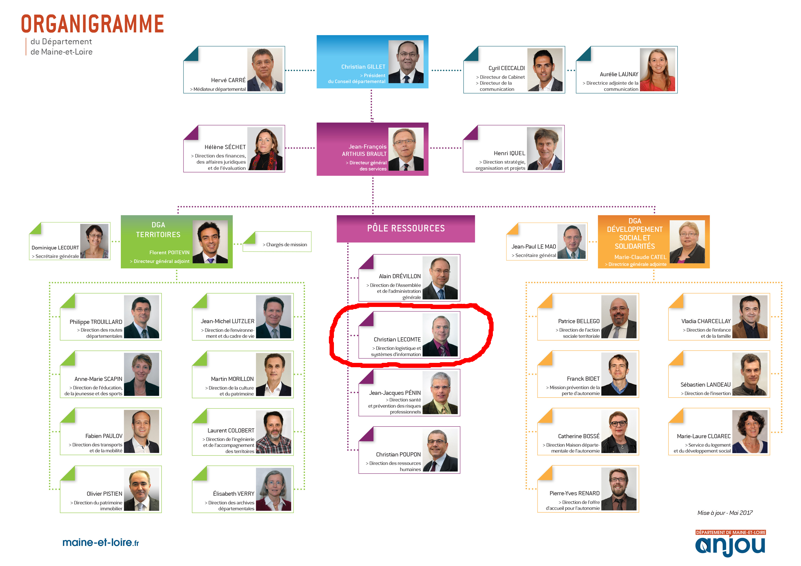
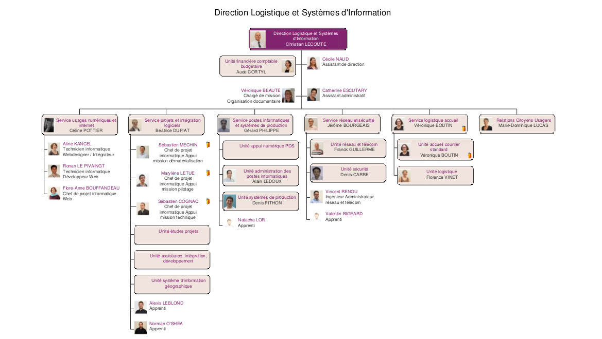
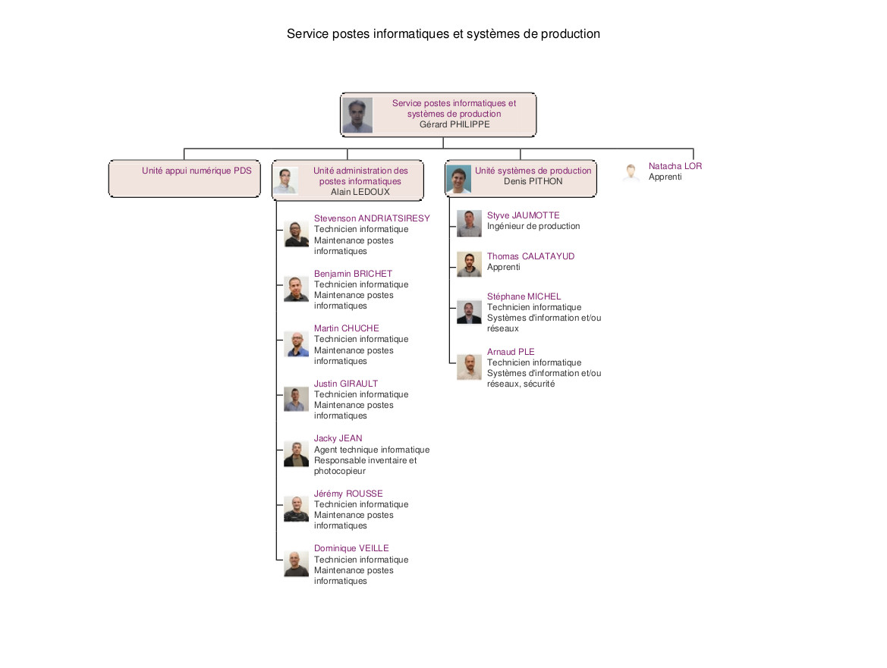
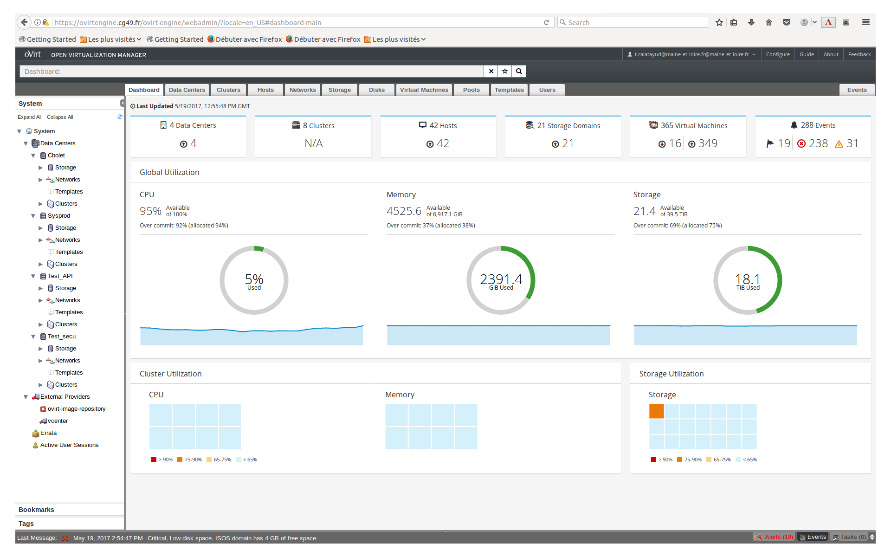
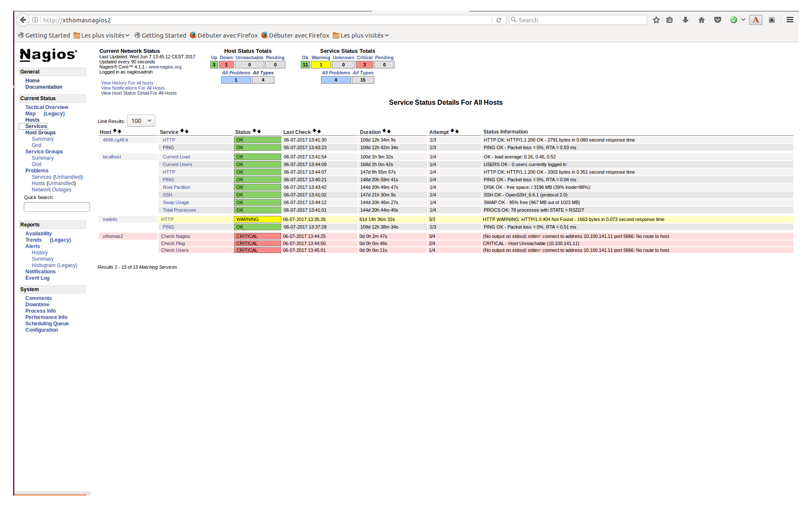
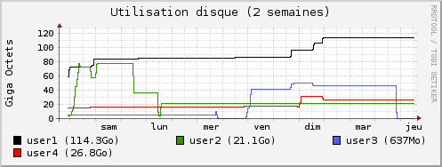
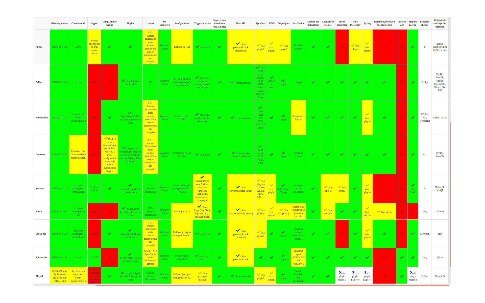
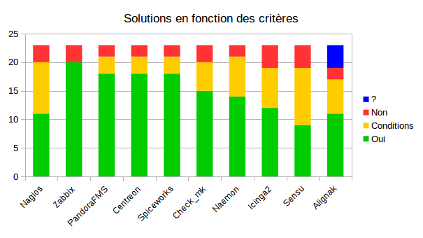
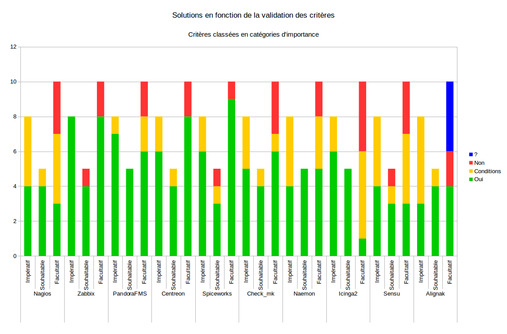

= Rapport d'apprentissage                    Master 1 - Informatique: Supervision open-source d'un système d'information
Thomas Calatayud <thomas.calatayud@etud.univ-angers.fr>
2016-2017
:description: Projet d'alternance de Master réalisé par {author}
:icons: font
:source-highlighter: coderay
:coderay-linemus-mode: inline
:toc: preamble
:toc-title: Table des matières
:toclevels: 3
:figure-caption: Image
:check: icon:check[role="green"]
:almost: icon:check[role="yellow"]
:uncheck: icon:times[role="red"]
:question: icon:question[role="blue"]
////
Pour enlever le toc en pdf
ifdef::backend-pdf[]
:toc!:
endif::[]
////

[.text-center]
Rapport rédigé par Thomas CALATAYUD +
Étudiant en Master Informatique à l'université d'Angers +
 +
 +
 +

[cols="<.^,>.^", frame="none", grid="rows"]
|===
|Responsable de stage +
M. Frédéric LARDEUX +
Enseignant chercheur +
LERIA, Université d'Angers +
frederic.lardeux@univ-angers.fr

|Tuteur en entreprise +
M. Denis PITHON +
Responsable de l'unité système de production +
Département de Maine et Loire +
d.pithon@maine-et-loire.fr
|===

== Remerciements

Je tiens avant tout à remercier Christian Lecomte, DSI du Conseil Départemental de Maine-et-Loire ainsi que Gérard Philippe, chef du service Poste Informatique et Système de Production, pour m'avoir accueilli au sein de la DLSI. Je remercie également mon tuteur en entreprise, M. Denis Pithon, pour son expérience, son soutien et ses conseils avisés, ainsi que Arnaud Plé, Styve Jaumotte et Stéphane Michel. Ils ont été mes principaux interlocuteurs, toujours présents pour me conseiller et m'accompagner. Je suis heureux d'avoir passé cette année d'apprentissage avec eux et de poursuivre l'année prochaine à leur côté.

Je remercie Cécile Naud qui a toujours été présente pour m'aider administrativement, mais aussi pour son soutien, sa gentillesse et sa bonne humeur. Merci aussi à tous les membres de la Direction Logistique et Système d'Information pour tout ce qu'ils m'ont apporté tout au long de cette première année.

Je remercie M. Frédéric Lardeux, enseignant à l'université d'Angers et chercheur au Laboratoire d'Étude et de Recherche en Informatique d'Angers, de m'avoir conseillé, accompagné lors de cette année d'apprentissage. C'est son enthousiasme qui m'a donnée l'envie et l'opportunité d'effectuer ce Master en tant qu'apprenti.

Pour finir, j'aimerai aussi remercier mon ami et collègue Alexis Leblond pour sa présence et sa bonne humeur à la fois à l'université et au Conseil Départemental.

<<<

toc::[]

<<<

== Introduction

Après avoir obtenu mon diplôme de Licence informatique, j'ai choisi de continuer mon parcours vers un Master Informatique. Deux choix se sont offerts à moi : continuer mes études dans un parcours orienté vers la recherche ou dans un parcours professionnalisant.

Mon premier choix était particulièrement porté vers le parcours recherche. Je me suis donc inscrit en première année de Master Informatique qui est générale aux deux parcours, dans l'optique de poursuivre sur une deuxième année en Master Intelligence Décisionnelle.

Il m'a été rappelé qu'il était notamment possible d'effectuer ces deux années de Master en alternance en entreprise.

Malgré ma passion pour les études, apprendre de nouvelles choses, la découverte et la recherche de nouveauté, l'idée d'effectuer ce Master en alternance m'a plutôt attiré, j'ai donc décidé de me lancer dans la recherche d'une entreprise, prête à m'accueillir et à m'offrir un sujet d'apprentissage qui puisse m'intéresser.

C'est ainsi que j'ai découvert une offre émanant du Conseil Départemental de Maine-et-Loire  ayant trait à la supervision des systèmes d'information. J'ai donc intégré le service Système de Production au sein de la Direction Logistique et Système d'Information en ayant pour projet de remettre à neuf le système de supervision. Pour cela on m'a demandé d'identifier les solutions libres ou open sources et de faire émerger les deux produits les plus à mêmes de répondre aux besoins de l'unité.

Finalement, j'ai choisis l'apprentissage pour me permettre d'avoir un premier aperçu de l'informatique dans un contexte professionnel. Cela me permet d'avoir un peu plus d'expérience dans ce domaine. Et grâce à cette alternance je peux continuer d'étudier à l'université tout en apprenant de nouvelles choses au Conseil Départemental. J'ai l'opportunité d'étudier et de travailler dans un domaine qui me plait. J'ai accepté ce sujet dans le but de découvrir l'administration système, un aspect de l'informatique que je ne connaissait pas beaucoup.

<<<

== Le Conseil Départemental de Maine-et-Loire

=== Présentation du Conseil Départemental

Le Conseil Départemental est une institution publique au service du territoire et des habitants de Maine-et-Loire. Il prend des décisions intéressant la vie quotidienne et décide de grands projets pour l'avenir du département. Les conseils départementaux sont les instances politiques des départements. Ils sont composés d'élus, les conseillers départementaux qui se réunissent au moins une fois par trimestre en Assemblée départementale.
En Maine-et-Loire, l'assemblée siège à L'Hôtel du Département, dans l'ancienne Abbaye Saint-Aubin en plein cœur du centre ville d'Angers. Elle est présidée par Christian Gillet depuis 2014.

Les conseillers départementaux sont élus par les citoyens du département pour une durée de six ans au suffrage universel direct à deux tours. Ils sont élus par binôme, composé d'une femme et d'un homme pour chaque canton du département. On compte 21 cantons en Maine-et-Loire dont sont issus 42 conseillers. Les cantons correspondent à un découpage territorial du département. Lors des Assemblées, l'ensemble des élus définit les orientations stratégiques et adopte les schémas directeurs, décide des plans d'actions dans les domaines de compétences du Département, débat et vote le budget du Département.

Environ 2800 agents territoriaux, techniciens ou administratifs, assurent les missions de service public pour le Département de Maine-et-Loire. Ils œuvrent chaque jour à la mise en place de la politique décidée par les conseillers départementaux.
Les services administratifs sont organisés en deux grande directions :

- La direction adjointe du développement social et des solidarités exerce les missions principales du Département et regroupe les services sociaux et solidaires. Elle gère les problématiques liées aux personnes âgées, aux personnes handicapées, à l'enfance, à la famille et aux insertions.

- La direction générale adjointe du territoire regroupe les services concernant les routes, l'éducation, la jeunesse, le sport, les transports et la mobilité, le patrimoine immobilier, l'environnement et le cadre de vie, l'ingénierie et l'accompagnement des territoires, la culture et le patrimoine, les archives départementales.
Certains de ces domaines, le tourisme, la culture et le sport, sont travaillés en collaboration avec d'autres collectivités (La Région et les intercommunalités).

Pour assurer le bon fonctionnement de ces deux grandes directions, un pôle ressources est établis. Il intègre plusieurs sous directions. La direction de l'Assemblée et de l'administration générale est garante de la bonne organisation des instances délibérantes que sont la Commission Permanente et le Conseil Départemental. Elle est le lien entre les élus et les différentes directions et services. +
La direction santé et prévention des risques professionnels a pour mission de prévenir des risques professionnels (santé, psychologique et social) tout en améliorant les conditions de travail. Elle assure l'intégration et l'accompagnement des personnes en situation de handicap. +
La direction des ressources humaines s'occupe de l'administration, la paie, la comptabilité et des contrats administratif. Elle gère les formations, le recrutement et l'accompagnement professionnel, la communication interne, le dialogue social et syndical. +
La direction logistique et systèmes d'information gère la logistique, l'informatique et les systèmes d'information. C'est cette direction qui comporte le service dans lequel je travail.

.Organigramme du Conseil Départemental

Internet, télécommunication, ordinateurs, smartphone, logiciels, reprographie, partage de documents, collaboration en ligne, services numériques, ... Les agents du Conseil Départemental utilisent tous des outils numériques dans leurs activités quotidiennes. L'accueil, les courriers, le parc automobile, les fournitures, la reprographie et les petits matériels sont des missions liées à la logistique présentes dans notre quotidien de travail. En effet, la direction logistique et systèmes d'information dirigée par son directeur M. Christian LECOMTE , veille à la cohérence et au bon fonctionnement de ces différents moyens de logistique, de traitement de l'information et de communication pour que tous les agents de la collectivité puisse travailler dans de bonnes conditions.

La DLSI se découpe en 6 services :

- Le service usages numériques et internet.
- Le service projets et intégration logiciels.
- Le service réseau et sécurité.
- Le service logistique accueil.
- Le service relation citoyens usagers.
- Le service postes informatiques et systèmes de production. C'est dans ce dernier service que j'ai été intégré

.Organigramme de la DLSI

Chaque service se décompose généralement en une ou plusieurs unités qui vont s'occuper d'une ou plusieurs tâches plus spécifiques. Mon service SPISP, géré par son chef de service M. Gérard PHILIPPE, se présente en deux unités distinctes, l'unité administration des postes informatiques et l'unité systèmes de production dans laquelle je travaille sous la responsabilité du responsable d'unité et tuteur de mon apprentissage M. Denis PITHON.

.Organigramme du Service Poste Informatique et Système de Production

<<<

=== L'unité Système de Production et ses missions

L'unité système de production travaille au sein de la DLSI du Conseil
Départemental de Maine-et-Loire sur les problématiques liées aux serveurs, au stockage, à la sauvegarde, la restauration, à la virtualisation, à l'administration des systèmes Linux et Windows, à l'administration des bases de données, à la gestion des profils et des boites mails, ainsi qu'à la supervision des matériels et applications cotés serveurs. L'unité s'engage via un système de tickets à résoudre les problèmes liés à ces domaines que les utilisateurs, les agents du Conseil Départemental pourraient rencontrer.

[NOTE]
.Quelques éléments d'information concernant le système d'information :
====
Virtualisation sur oVirt (Linux/KVM) outil open source

* ~ 365 VMs (55% Linux, 45% Windows) réparties sur 42 serveurs physiques

* la moitié de ces VMs servent les applications métiers des 2800 agents

* Stockage NAS (NFS et CIFS) répliqué sur deux salles

* 18 To consommés pour les VMs sur un total de 40 To disponibles

* 21 To consommés pour la bureautique

* Supervision avec Nagios
====

<<<

==== La Supervision

//https://www.monitoring-fr.org/supervision/

La supervision est une fonction permettant d'indiquer, contrôler, commander l'état d'un système ou d'un réseau. Les outils de supervision remontent des informations techniques et fonctionnelles du système d'information. Le tout dans un but de détection et de traitement des problèmes le plus automatique possible.

L'informatique est intégrée et est devenue un outil indispensable dans une entreprise, quel que soit son secteur d'activité, le système d'information est placé désormais au centre de l'activité de différentes entités métiers et doit fonctionner pleinement et en permanence pour garantir l'efficacité de l'entreprise. A tous les niveaux, les réseaux, les terminaux utilisateurs, les serveurs d'applications et toutes les données constituent autant de maillons sensibles dont la disponibilité et la qualité de service conditionnent le bon fonctionnement de l'entreprise.

Il existe deux enjeux majeurs pour les directions informatiques. Le premier est de garantir la disponibilité et les niveaux de service du système en cas de panne ou de dégradation des performances. Le second est de prévenir en cas de problème et, le cas échéant, garantir une remontée d'information rapide et une durée d'intervention minimale. Ces enjeux sont assurés par la supervision.

La supervision recouvre les activités ou les aspects suivants :

- Surveiller
- Visualiser
- Analyser
- Prévenir
- Piloter
- Agir
- Alerter

Elle permet de couvrir l'ensemble du Système d'Information d'une entreprise :

- Le réseau et ses équipements
- Les serveurs
- Les périphériques
- Les applications
- Le flux de travail

<<<

==== Présentation de l'outil Nagios

//Supervision de serveurs, services, BD, environnement (Température, Luminosité, clim), équipement,...
//http://artisan.karma-lab.net/supervision-nagios

Nagios, qui s'appelait précédemment NetSaint, est un outil de supervision libre sous licence GPL. Développé en 1996, Nagios, s'architecture autour d'un moteur écrit en C. Il permet d'auditer en permanence des machines, des services sur ces machines, de recevoir des alertes (mails, SMS...) en cas de problème et de disposer d'un tableau de bord de l'état du système à un moment donné. C'est un programme modulaire qui se décompose en trois parties :

- Le moteur de l'application qui vient ordonnancer les tâches de supervision.
- L'interface web, qui permet d'avoir une vue d'ensemble du Système d'Information et des éventuelles anomalies.
- Les sondes (ou plugins), une centaine de mini programmes/scripts que l'on peut compléter, voire même créer, en fonction des besoins de chacun pour superviser les services ou ressources disponibles sur l'ensemble des éléments du réseaux du Système d'Information.

Cet outil offre de nombreuse possibilités :

- De superviser des services réseaux (SMTP, HTTP, ...)
- De superviser les ressources des serveurs (charge du processeur, occupation des systèmes de fichiers, utilisation de la mémoire, ...) sur la majorité des systèmes d'exploitation.
- De superviser les équipements réseau (CPU, ventilateurs, ...)
- De superviser les Bases de données
- De superviser l'environnement (température, luminosité, humidité, ...)
- Interface via le protocole SNMP
- De superviser à distance via SSH ou agent NRPE.
- De remonter des alertes par mails, SMS via un système de notification.
- De gérer des utilisateurs (accès limité à certains utilisateurs)
- Les plugins sont écrits dans des langages de programmation les plus adaptés à leur tâche : scripts shell (bash, ksh, ...), C++, perl, Python, Ruby, PHP, C#, ... et il est possible de créer très facilement ses propres modules.

<<<

=== Étude et mise en place d'une solution libre/open-source de supervision

Avant tout, il me semble important de clarifier le terme de solution libre et de solution open-source.

.Un logiciel libre

Pour qu'un logiciel soit considéré comme "libre", il doit garantir 4 libertés fondamentales à son utilisateur telles que définies par la Free Software Foundation :

- Liberté 0 : la liberté d'exécuter le programme pour tous les usages.
- Liberté 1 : la liberté d'étudier le fonctionnement du programme, et de l'adapter à ses besoins.
- Liberté 2 : la liberté de redistribuer des copies du logiciel.
- Liberté 3 : la liberté d'améliorer le programme et de publier ses propres améliorations.

Les libertés 1 et 3 impliquent un accès total aux sources d'un programme, sinon le logiciel ne peut être considéré comme un logiciel libre.

Il n'est pas fait mention ici de la gratuité, on peut donc tout à fait vendre un logiciel libre bien qu'on ne puisse empêcher un acheteur de redistribuer le logiciel à titre gratuit.

.Un logiciel open-source

Les licences open-source sont le fruit de l'Open Source Initiative, née à la suite de nombreuses divergences au sein de la communauté "libre".

Plus pragmatique, l'OSI souhaitait proposer une licence plus lisible aux professionnels et entreprises qui avaient tendance à repousser les licences libres pour de nombreuses raison, parmi lesquelles le problème de compréhension entre "libre" et "gratuit"

L'OSI a donc crée une définition de l'open source qui décrit 10 conditions requises pour qu'une licence appliquée à un logiciel soit considérée open source :

- Condition 1 : la libre distribution logicielle. La licence ne peut, par exemple faire l'objet d'une redevance supplémentaire.
- Condition 2 : le code source doit être fourni ou accessible. Un patch peut être fourni en tant que package indépendant, contrairement avec un logiciel libre ou il faut obligatoirement fournir tout le code.
- Condition 3 : les dérivés des oeuvres doivent être permises.
- Condition 4 : l'intégrité du code source doit être préservée. La licence ne peut restreindre l'accès au code source.
- Condition 5 : pas de discrimination entre les groupes et les personnes. Toute personne détentrice du logiciel bénéficie des termes de la licence tant qu'elle s'y conforme elle-même.
- Condition 6 : pas de discrimination entre les domaines d'application. la licence se limite à la propriété intellectuelle, elle ne peut en aucun cas réguler d'autres domaines.
- Condition 7 : la licence s'applique sans dépendre d'autres contrats. On ne peut par exemple ajouter d'accord de confidentialité lors de la cession du logiciel.
- Condition 8 : la licence ne doit pas être propre à un produit. Elle est attachée au code source et non à un logiciel particulier. Une brique logicielle peut donc être ré-utilisée dans un logiciel différent.
- Condition 9 : la licence d'un logiciel ne doit pas s'étendre à un autre.
- Condition 10 : la licence doit être neutre technologiquement. Elle ne concerne que le code et pas les technologies et applications qui en découlent.

Il existe de très nombreuses licences open-source et la grande majorité sont également considérée comme libres. Il n'est pas obligatoire d'être certifié par l'OSI pour être définie comme licence open-source, mais il faut qu'elle respecte ces 10 conditions pour qu'elle soit considérée comme telle. Il est commun de vulgariser l'ensemble des logiciels open-source ou libre alors qu'ils ne le sont pas toujours réellement. Il est donc important de bien définir ces deux mouvements et de bien identifier les licences des logiciels.

Actuellement, la supervision de l'ensemble du système d'information est opérée par Nagios. Cette solution libre,
en place depuis près de 10 ans, contrôle un peu plus de 2700 points de
fonctionnement du SI (espaces disques, sites webs, bases de données,
consommations CPU, RAM ...).

.*Il m'est demandé dans le cadre de mon apprentissage de :*
. Identifier et comparer les solutions libres/open-sources de supervision
. Préconiser la solution la plus adaptée aux besoins de l'unité
. Mettre en place la solution de supervision retenue

<<<

=== Mon activité au sein de l'unité

==== Mise à niveau technique

À mon arrivée, j'ai souhaité acquérir de nouvelles compétences en administration système pour aborder convenablement mon sujet d'apprentissage. J'ai donc effectué une série d'exercices à difficulté progressive. Ils avaient pour but de me faire progresser sur l'environnement serveur Linux et les outils qui lui sont habituellement associés et me familiariser avec l'administration système.

Avant tout, il a fallu que j'installe et je configure entièrement mon poste de travail sous Linux.

J'ai ensuite découvert l'outil oVirt que notre unité utilise pour la gestion de son cloud privé.

.Ovirt

J'ai d'ailleurs plus tard grâce à cet outils répondu aux besoins d'un utilisateur. En effet, nous recevons parfois des demandes d'installation, de configuration et dépannage concernant les serveurs pour certains utilisateurs. C'est mon collègue, lui aussi étudiant de l'université d'Angers et apprenti travaillant à la DLSI du Conseil Départemental au service projets et intégration logiciels, qui nous a fait la demande de l'installation et la configuration d'un serveur et d'une base de donnée pour qu'il puisse travailler sur son projet de gestion de contrôle technique du parc automobile du Conseil Départemental. Mon tuteur Denis, m'a confié cette tâche pour prendre encore un peu plus en main l'installation et la configuration d'un serveur.

===== Monter un disque sur un périphérique fichier

Un autre exercice était de construire et monter un disque d'une très grosse capacité sur un disque physique beaucoup plus petit sur mon poste. Il a fallu que je trouve un moyen d'effectuer cette tâche.

Un des moyens pour réaliser cette tâche était d'utiliser la commande dd qui permet de copier une partie d'un disque ou du système de fichiers par blocs d'octets, indépendamment de la structure et du contenu du système de fichiers. Grâce à cette commande, on peut simuler un fichier d'une très grande taille en spécifiant un décallage de blocs sur le fichier de sortie. Ainsi, on indique le début du fichier, puis on lui dit de sauter autant de blocs que nécéssaire pour écrire la fin du fichier. Il ne reste plus qu'à monter le fichier et changer son format pour obtenir un "disque virtuel".

[[app-listing]]
[source,shell]
----
tcalatayud@tcalatayud-CD49:~$ df -lh
...
/dev/sda1       451G  8,7G  420G   3% /
/dev/loop0       15T  6,3M   15T   1% /media/tcalatayud/e9567653-9578-4332-b449-37eb63cabc7b # <1>
...
----
<1> J'obtiens donc un disque d'une taille de 15 To sur lequel je peux écrire et lire des fichiers. Cependant, il est évident qu'avant de pouvoir le remplir complètement je risque d'avoir quelques problèmes étant limité par la taille du stockage sous jacent.

===== Script d'alertes mail, inotify

Je me suis lancé sur un second exercice, écrire un script d'actions sur évènement de système de fichiers. Plus simplement, il s'agissait d'effectuer la surveillance d'un répertoire et de rapporter par mail tout les évènements qui s'y étaient produit.

Dans un premier temps j'ai écrit un premier script en shell bash. Ce script transfère par mail un fichier donnée en paramètre s'il est dans le répertoire surveillé puis il le supprime une fois qu'il a été envoyé.

J'ai ensuite écrit une deuxième version améliorée, utilisant le mécanisme inotify proposé par le noyau Linux qui fournit des notifications concernant le système de fichiers. Ce mécanisme permet de mettre en place des actions associées à l'évolution de l'état du système de fichiers. Les principaux événements qui peuvent être suvis sont :

- *IN_ACCESS* : Le fichier est accédé en lecture
- *IN_MODIFY* : Le fichier est modifié
- *IN_CLOSE_WRITE* : Le fichier est fermé après avoir été ouvert en écriture

Et enfin, j'ai écrit une dernière version en Python3 qui s'exécute en tant que daemon. D'un point de vue strictement technique, sous un système UNIX, un daemon peut être n'importe quel processus ayant le processus init (le premier processus lancé au démarrage de la machine) comme parent. En d'autres termes, pour qu'un processus soit un daemon dans le sens strict du terme, est qu'il soit complètement détaché du terminal et gérer entièrement par le système sans que l'utilisateur puisse reprendre le contrôle dessus. Communément un deamon est simplifié par n'importe quel processus fonctionnant en arrière-plan, qu'il soit ou non un enfant du processus init, c'est à dire que le processus s'exécute en tâche de fond par le système, sans que l'utilisateur s'en aperçoive.

J'y ai inclus la gestion de logs pour qu'on puisse avoir un rapport, si nécessaire, des actions que le script a effectué et pour permettre d'avoir un aperçu du bon fonctionnement et de la bonne exécution du programme.

J'ai notamment utilisé un fichier de configuration de type "ini" qui permet de définir des paramètres à l'utilisateur et de les rassembler dans un même endroit pour pouvoir les utiliser ensuite dans le programme.

[[app-listing]]
[source,ini]
.script.ini
----
[config_mail]
fromaddr = t.calatayud@maine-et-loire.fr # <1>
toaddr = t.calatayud@maine-et-loire.fr # <2>
server = smtp.cg49.fr # <3>
port = 25

[config_inotify]
watchFolder = /home/tcalatayud/sendMailPython/dossier # <4>

[config_daemon]
pidfile = /home/tcalatayud/sendMailPython/daemon.pid # <5>
logfile = /var/log/MyLog/MyScriptDaemon.log # <6>
----
<1> Adresse mail de l'expéditeur
<2> Adresse mail du destinataire
<3> Serveur smtp
<4> Chemin du répertoire surveillé
<5> Chemin du fichier où on retrouve l'id du processus
<6> Chemin du fichier de log

Pour l'exécuter, il suffit de lancer le programme avec l'argument "start". Il s'arrête avec l'argument "stop". Il est possible d'obtenir les informations concernant le statut du programme avec l'argument "status".

Je n'ai pas poursuivi plus loin cet exercice. Mais il aurait été possible de l'intégrer à systemd (le système d'initialisation du noyau Linux) afin de l'intégrer plus finement au système de démarrage Linux.

==== Découverte, déploiement, installation et configuration de l'outil Nagios

Dans la continuité de cette mise à niveau, j'ai commencé à regarder l'outil Nagios, à voir comment il fonctionne, s'installe, se configure et s'utilise.

J'ai décidé, pour prendre en main cet outil complexe et puissant, de mettre en place ma propre instance de Nagios.

Il m'a été nécessaire d'abord, de configurer un serveur pour pouvoir le déployer. J'ai donc installé et configuré, grâce à l'outil Ovirt, une nouvelle machine virtuelle sous CentOS, qui est une distribution Linux pour les serveurs. Puis je me suis lancé dans l'installation du Nagios en suivant la documentation, sur lequel j'ai configuré quelques sondes pour comprendre leur fonctionnement.

Nagios est basé sur un ensemble de fichiers de configuration. Ces fichiers sont situés par défaut dans le dossier _/usr/local/nagios/etc/_ et généralement classés sous forme de contact, d'hôtes, de services et de commandes.

Les contacts représentent les personnes qui seront alerté en cas d'alertes. Il faut leur définir une adresse mail et des périodes de notifications.

Les hôtes sont les différents serveurs, équipements en réseaux que l'on supervise. Il est impératif de définir l'adresse IP à laquelle ils sont affectés sur le réseau.

Pour chaque hôte il faut définir les différents services à superviser en lui précisant la commande à éxecuter et en précisant les différents arguments, si nécéssaire. Ils remontent via les commandes et les points de contrôle l'état des hôtes dans lequel ils sont. Classiquement, trois types d'états pour les services sont reconnus :

- *OK*
- *WARNING*
- *CRITICAL*

Les points de contrôle sont les scripts éxecutés par les commandes des différents services qui vont permettre de récupérer les données nécessaires pour indiquer et mettre à jours l'état de ces services.

Dans un premier temps il a fallu que je configure un contact pour y déclarer principalement l'adresse mail sur laquelle je compte recevoir les alertes.
[[app-listing]]
[source,cfg]
.contacts.cfg
----
define contact{
        contact_name                        nagiosadmin
        use                                 generic-contact
        alias                               Nagios Admin
        email                               t.calatayud@maine-et-loire.fr
        service_notification_period         24x7
        service_notification_options        w,u,c,r,f,s
        service_notification_commands       notify-service-by-email
        host_notification_period            24x7
        host_notification_options           d,u,r,f,s
        host_notification_commands          notify-host-by-email
        }
----

Dans un deuxième temps, j'ai rajouté les différents hôtes que je souhaite superviser.
Voici un exemple d'hôtes que j'ai configuré. C'est le serveur hébergeant le site web interne prévu pour les agents du département.
[[app-listing]]
[source,cfg]
.hosts/melinfo.cfg
----
define host {
        use                     generic-host
        host_name               melinfo
        alias                   Melinfo
        address                 10.100.49.110
        hostgroups              linux-servers
        check_interval          5
        retry_interval          1
        check_command           check-host-alive
        max_check_attempts      10
        contact_groups          admins
        register                1
}
----

Enfin, il faut configurer les services liés à chaque hôte, les données que je souhaite superviser.
[[app-listing]]
[source,cfg]
.services/melinfo_service.cfg
----
define service {
        use                     generic-service
        host_name               melinfo
        service_description     HTTP
        check_command           check_http
        notifications_enabled   0
} # <1>

define service {
        use                     generic-service
        host_name               melinfo
        service_description     PING
        check_command           check_ping!100.0,20%!400.0,90%
} # <2>
----
<1> Ce service va utiliser un point de contrôle, une commande qui va envoyer une requête http dans le but de savoir si oui ou non le serveur web répond.
<2> Ce service va utiliser un point de contrôle qui va remonter le temps de réponse d'un ping. Cette commande est configurée de sorte que si le temps de réponse dépasse 100 ms il se placera dans l'état WARNING. Si le temps de réponse dépasse 400 ms il se placera dans l'état CRITICAL.

Voici quelques exemples de commandes utilisant des points de contrôle définit par Nagios.
[[app-listing]]
[source,cfg]
----
define command{
        command_name    check_http
        command_line    $USER1$/check_http -I $HOSTADDRESS$ $ARG1$
        }

define command{
        command_name    check_ping
        command_line    $USER1$/check_ping -H $HOSTADDRESS$ -w $ARG1$ -c $ARG2$ -p 5
        }

define command {
       command_name     check_local_disk
       command_line     $USER1$/check_disk -w $ARG1$ -c $ARG2$ -p $ARG3$
}
----

Il est possible avec Nagios de créer des templates ou groupes pour les contacts, hôtes et services. Ces templates permettent d'uniformiser les configurations de contacts, hôtes et services qui se ressemblent pour pouvoir les déclarer plus simplement les prochaines fois.

Avec cette méthode de configuration, sous forme de fichiers, il est important pour garder un environnement propre et pour permettre une maintenance plus simple, de bien gérer l'arborescence de tous ces fichiers de configurations. Dans le cas contraire on se retrouve rapidement perdu et on risque de ne plus savoir où ont été rangé les fichiers pour pouvoir les modifier.

On obtient un Nagios configuré et prêt à superviser. On peut désormais se diriger vers l'interface web pour avoir enfin l'aperçu de notre système de supervision.
_http://xthomasnagios2/_

.Services Nagios

==== Synchronisation des Nagios de l'unité

Pour l'unité, deux serveurs Nagios sont installés qui servent à la supervision des sites web publiques du Conseil Départemental, un serveur principal et un deuxième Nagios secondaire. Dans le cas d'une panne du serveur principal, j'ai dû trouver un moyen de pouvoir synchroniser sa configuration sur le Nagios secondaire.

J'ai donc écrit un programme s'exécutant en tant que service système, c'est à dire un daemon système géré par le protocole systemd. Utilisable via la commande systemctl, ce petit programme utilise, dans la même optique que le script d'envois de mail que j'ai écrit, le système inotify pour surveiller le répertoire de configuration de Nagios. Lorsqu'il repère un changement, il va transférer au Nagios secondaire, une archive contenant la configuration du Nagios principal, permettant ainsi d'avoir toujours la dernière configuration bien à jours. Ainsi, si le Nagios principal tombe en panne, sa configuration sera disponible sur le second Nagios. Il ne restera plus qu'à extraire l'archive dans le dossier de configuration et relancer le Nagios pour prendre en compte les modifications.

==== Mise en place d'un nouveau datacenter et installation de baies de stockage.

Pour répondre aux besoins grandissant du Conseil Départemental, l'ouverture d'une nouvelle salle de serveurs a été nécessaire. En effet, pour assister les trois autres salles déjà en place, dont une sur le site de Frémur, une sur le site de Lavoisier et une dernière dans nos locaux du centre ville, une 4ème salle sur le site de Frémur à été mise en place. Elle est mutualisée avec 4 autres Conseils territoriaux et est consacrée au système d'archivage électronique inter-départemental et régional. J'ai donc assisté aux travaux et à son installation. J'ai notamment assisté au déploiement de l'outil Ovirt pour ce nouveau réseau et j'ai moi même mis en place le Nagios.

En parallèle à cette installation, j'ai aussi pu aider à mettre en place sur le site de Lavoisier de nouvelles baies de stockages.

Grâce à ces interventions, j'ai pu constater qu'un administrateur système n'est pas seulement un informaticien qui règle les problèmes derrière son bureau, mais c'est aussi un technicien qui doit répondre à des questions techniques concernant le matériel et qui doit s'assurer du bon déploiement et du bon fonctionnement du matériel qu'il utilise.

<<<

== Identification des solutions libres/open-sources de supervision

Comme décrit dans l'intitulé de mon projet d'apprentissage, notre service utilise l'outil Nagios pour la supervision.

Malgré sa grande importance et son utilisation quotidienne au sein de nos activités, cette solution mise en place depuis plus 10 ans au Conseil Départemental, n'a pas été suffisamemnt maintenue. L'état actuel de sa configuration est désormais difficile à entretenir, au point de se demander s'il ne vaut pas mieux se pencher sur une toute nouvelle solution, plutôt que de se perdre dans nos fichiers pour remettre à jours, voir peut-être réinstaller, une instance plus propre de Nagios.

Malgré son énorme catalogue de possibilité, Son système de configuration via un ensemble de fichier rend sa maintenance plutôt laborieuse et des problèmes de compatibilité peuvent parfois survenir sur certains niveaux, notamment au niveau de certains plugins, lors des mises à jours.

De plus, vu le manque de réactivité du développeur principal de Nagios et sa volonté de ne plus diffuser tous les modules sous licence libre, de nombreux développeurs actifs sur le projet ont fait diverger Nagios. Ainsi, d'autres outils plus ou moins similaire à Nagios ont émergé.

S'ouvre donc l'opportunité de découvrir ces nouvelles solutions. C'est de cette occasion, que l'unité a souhaité m'engager pour dresser l'état des lieux des solutions existantes afin de refondre la supervision de son système d'information.

=== Inventaire des solutions libres/open-sources.

Pour trouver une nouvelle solution de supervision, il était nécessaire de connaître les enjeux de la supervision, les solutions existantes sur le marché et ce qu'elles proposent. J'ai commencé mes recherches sans connaissance de l'état de la solution existante.

J'ai en effet choisi de faire l'inventaire le plus exhaustif et complet possible avec un regard "naïf" sur la supervision. Grâce à ce regard neuf, je pouvais être capable d'identifier un maximum de solutions sans me restreindre aux fonctionnalités dont l'équipe a besoin. Le seul critère de recherche que l'équipe m'a réellement imposé lors de cet inventaire est le fait que la solution soit libre ou open-source.

Durant ce recensement, j'ai pu inventorier une énorme quantité de solutions. Pas moins de 72 solutions sont ressorties.

Par le biais de ces recherches j'ai pu distinguer différents types de supervision :

- *La supervision technique* : Elle se sépare en deux sous catégories.
..  *La supervision réseau* : Il s'agit ici de l'aspect communication entre les machines. Elle va consister à s'assurer du bon fonctionnement des communications et de la performance des liens (débit, latence, taux d'erreurs). C'est dans ce cadre qu'il est possible par exemple, de vérifier si une adresse IP est toujours joignable, ou si tel port est ouvert sur telle machine, ou de faire des statistiques sur la latence du lien réseau.
..  *La supervision système* : Elle consiste à surveiller les machines elles-mêmes et en particulier ses ressources, par exemple, contrôler la mémoire utilisée ou la charge processeur sur le serveur, voir analyser les fichiers de logs système.
- *La supervision applicative ou métier* : Plus subtile, elle consiste à surveiller les applications et les processus métiers des agents au sein de l'entreprise.

Pour résumer, la supervision va dépendre principalement de l'activité de l'entreprise mais aussi et surtout de son besoin. Il est rare de trouver un même type de supervision d'une entreprise à une autre. Mais cela reste abstrait. Concrètement et généralement, une entreprise supervise les serveurs, les switchs, les routeurs, les téléphones en réseau, les caméras en réseau, les badgeuses, les sondes, la bande passante, le CPU, la mémoire, les disques, les processus, les services, les bases de données, le bon déroulement des actions (backups, transferts, ...). Tout est supervisable tant qu'il est possible de récupérer et analyser des informations provenant des différents équipements que l'entreprise souhaite superviser.

Un système de supervision est basé généralement sur un serveur central. Il lui est souvent associé les fonctions suivantes :

- Interroger un agent installé directement sur l'équipement à surveiller, pour avoir une vue de l'intérieur du système.
- Interroger chaque service ou équipement directement depuis la base centrale, pour avoir une vue de l'extérieur du système.
- recevoir les alertes émises par les équipements et les retransmettre. Notifier les administrateurs.
- Agir pour remettre en service
- Archiver les données récoltées et produire des rapports statistiques ou graphiques.
- Permettre de visualiser l'état du système d'information.

Il est important que ces tâches soient effectuées le plus automatiquement possible pour libérer cette charge de travail à l'administrateur.

==== Les protocoles utilisés par la supervision

Il est possible d'accéder à de nombreuses informations localement sur une machine en utilisant des outils système. En quelques lignes de script shell par exemple, on peut construire un rapport d'état de la machine. On rajoute une entrée dans la crontab (la table de planification permettant aux utilisateurs des systèmes Unix d'exécuter automatiquement des scripts) des commandes ou des logiciels à une date et une heure spécifiées, ou selon un cycle défini à l'avance, et la supervision locale peut être assurée. De nombreuse lignes de commandes sont aussi disponibles pour avoir un rapide aperçu de l'état d'un système. La commande ping, par exemple pour tester si une machine est connectée au réseau. Ou encore, la commande free, pour visualiser la mémoire, ...

En parallèle, il y a l'IPMI, Intelligent Platform Management Interface. IPMI est une spécification commune à la plupart des constructeurs, permettant de superviser une machine, indépendamment de son système d'exploitation, y compris si elle est éteinte mais connectée à une prise électrique.

Le cœur d'IPMI est un contrôleur appelé BMC (Baseboard Management Controller). Il surveille les différents capteurs intégrés à la carte mère, comme la température, la vitesse de rotation des ventilateurs, l'état du système d'exploitation, ... et permet certaines actions sur la machine comme l'extinction ou le démarrage.

ICMP (Internet Control Message Protocol) est un protocole de couche réseau qui vient palier à l'absence de message d'erreur du protocole IP. En effet, s'il y a un incident de transmission, les équipements intermédiaires vont utiliser ce protocole pour prévenir la machine émettrice. Les paquets ICMP sont encapsulés dans des paquets IP, et peuvent contenir des bouts de paquets IP pour citer celui ayant généré l'erreur. Afin de catégoriser les erreurs, elles sont divisés en types eux-mêmes parfois redivisés en codes. C'est un protocole très simple, qui n'a pas pour fonction directe la supervision d'un réseau mais qui est utilisé comme source d'information sur la qualité du réseau ou sur la présence d'une machine.

Un autre protocole très utilisé, voir indispensable dans la supervision, le SNMP, Simple Network Management Protocol, est principalement utilisé pour superviser des équipements réseaux, des serveurs ou même des périphériques tels que des baies de stockages de disques, des sondes météorologique, des onduleurs, ...

Le protocole SNMP est basé sur trois éléments :

- Un équipement à superviser qui contient des objets à gérer, des informations de configuration, des données techniques, des statistiques, ...
- Il exécute un agent, un programme qui agrège les données locales.
- Une console de supervision qui permet d'interroger les agents accessibles par le réseau ou de recevoir des alertes émises par les agents via des ports UDP (User Datagram Protocol).

Le protocole Syslog est aussi un outil très utile pour la supervision. C'est un protocole de transmission d'événements systèmes. Il permet de centraliser les événements systèmes de chaque serveur ou équipement réseau sur une seule machine pour des fins d'analyse statistique, d'archivage ou production d'alertes. Retrouvé dans les journaux, chaque événement système est accompagné de son type de service, sa gravité, la date et l'heure à laquelle l'événement est survenu, et l'hôte sur lequel l'événement s'est produit.

De nombreux autres protocoles sont utilisés mais tous les citer et les expliquer serait beaucoup trop long. C'est pour cela que je ne présente que les plus importants, ceux qui sont les plus utilisés par les différentes solutions de supervision.

==== Visualisation de la supervision

En supplément de ces protocoles, les solutions de supervision sont souvent accompagnées d'outils ou de logiciels de suivi graphiques. En effet, une fois les données récupérées, il est souvent intéressant de les visualiser. Pour ça, les outils de supervision comme MRTG, Munin, Ganglia, Cacti, ... utilisent régulièrement, une suite d'utilitaires de création de graphes basés sur des statistiques temporelles appelé RRDtool. Cet outil de gestion de base de données RRD (Round-Robin database) devenu incontournable, est utilisé pour la sauvegarde de données cycliques et le tracé de graphiques. C'est un outil idéal pour superviser des données serveurs, telles la bande passante ou la température d'un processeur.

.Graphique RRDtool

Mais il existe d'autres outils permettant de stocker et transformer les données en graphiques : Graphite, Kibana, ou encore Grafana, un outil très simple d'utilisation et entièrement configurables permettant de rendre un visuel esthétique et lisible sur une large variété de données.

Lorsque le système d'information s'élargit, lorsqu'il commence à prendre de l'ampleur et qu'il faut superviser un grand nombre d'hôtes et de services. Il indispensable d'avoir un aperçu global de l'état de ces hôtes et de ces services. En effet, voir d'un rapide coup d'œil les données supervisées le plus synthétiquement et globalement possible, est un enjeu important.

Beaucoup de solutions misent d'ailleurs sur ce point. Certaines proposent des interfaces sophistiquées, habituellement destinées pour le web, permettant justement cet aperçu global de l'état des hôtes et des services supervisés. Elles incluent généralement des tableaux de bords configurables, nous offrant la possibilité de choisir les vues importantes, souvent accompagnées par les graphiques adéquats.

D'autres solutions préfèrent se concentrer sur le moteur de supervision, laissant place parfois à des tiers la possibilité de développer leur propre interface qu'ils partagent ensuite à la communauté. Ainsi, par exemple, pour Nagios, on retrouve en parallèle à son interface web simpliste, des versions parfois plus évolués et plus esthétiques développées et mises à disposition par la communauté (Adagios, NConf, Thruk, ...).

De cet inventaire, on constate des fonctionnalités ressortant sur la plupart des solution. Ces fonctionnalités, que l'on pourrait qualifiées parfois d'indispensables pour la supervision semblent former des critères important dans le choix d'une bonne solution de supervision, comme la nécessité d'un protocole SNMP, d'alertes, d'interface web, ...

<<<

=== Établir les critères de sélection

On peut donc s'apercevoir grâce à cet inventaire, qu'il existe énormément de solutions. Cependant, il n'est pas pertinent de tester ces 72 solutions en profondeur. Il est donc nécessaire de réduire cette liste.

J'ai donc commencé à faire un premier filtrage et à réduire drastiquement la liste des solutions établies. Je suis ainsi passé d'une liste de 72 solutions à une liste d'une dizaine de solutions. Ces 10 solutions se sont démarquées principalement par mon analyse personnelle de Nagios et des discussions avec les membres de l'équipe.

Mais une liste de 10 solutions semble toujours autant compliqué à évaluer et à tester. Malgré ma curiosité et mon envie de vouloir tester le plus de solution possible, l'équipe et moi avons décidé de n'en retenir que deux. Pour les identifier, il est nécessaire de savoir lesquels sont les plus intéressantes selon nos besoins.

C'est ainsi qu'est apparu la nécessité d'établir un ensemble de critère définissant si telle ou telle solution est plus intéressante qu'une autre. Ainsi, à l'image d'un tamis, les critères que j'aurai établi pourront filtrer les solutions restantes en faisant ressortir les deux meilleures.

Est donc venu le moment de bien identifier les besoins de l'unité. En effet, pour construire ce filtre il a fallu dans un premier temps, cerner le domaine à superviser. J'ai parcouru les Nagios déjà installés pour identifier et lister les différentes sondes mises en place. Dans un deuxième temps, j'ai repris les solutions restantes du premier filtrage pour les comparer entre elles et identifier des fonctionnalités qui sont souvent utilisées. En parallèle, de nombreuses discussions avec l'équipe m'ont permis d'établir une liste de 25 critères que j'ai classé selon trois catégories : les critères impératifs, souhaitables ou facultatifs.

Voici donc la liste classée des critères retenus avec une brève explication concernant le critère et _son appréciation._

include::../recherches/criteres.adoc[]

Une fois validés par l'équipe, j'ai pu utiliser ces critères et les croiser avec les solutions candidates dans un tableau à double entrée faisant ressortir les solutions que je vais pouvoir tester.

.Tableau comparatif des solutions en fonction des critères

{check} : Possible +
{uncheck} : Impossible +
{question} : Pas d'informations

On peut donc rapidement juger quelles sont les solutions les plus intéressantes par un code couleur intuitif : vert indique que le critère est respecté, jaune indique que le critère est respecté sous certaines conditions (par exemple via un plugin) et rouge indique que le critère n'est pas respecté.

J'ai aussi généré deux graphiques permettant de mieux comparer de façon plus quantifié.

.Graphique représentant les solutions en fonction des critères

Plus la solution présente de vert, plus elle aura de critères validés et totalement intégrés. +
Plus la solution présente de jaune, plus elle aura besoin de module/plugins supplémentaires à installer. +
Plus la solution présente de rouge, plus elle aura de critère non validés. +
Les solutions présentant du bleu sont des solutions où je n'ai pas trouvé d'information concernant certains critères.

.Graphique représentant les solutions en fonction des critères classés selon leur importance.

Ce second graphique reprend le principe du premier graphique, en précisant les différentes catégories de critères (Impératif, souhaitable, facultatif). Ainsi, on peut voir d'un rapide coup d'œil quelle solution rempli les critères les plus important. Ce graphique permet de faciliter l'identification des deux meilleures solutions.

<<<

=== Évaluation de deux solutions

Présentation de 2 solutions : application des critères sur deux solutions.

==== Nagios

==== Zabbix

<<<

== Bilan

Cette première année d'apprentissage au Conseil Départemental a dans un premier temps été l'occasion pour moi d'avoir une première expérience de travail dans un contexte qui me plait vraiment : l'informatique.

De plus, j'ai pu découvrir un domaine de l'informatique que je ne connaissais pas : l'administration système. Mon apprentissage m'a permis d'acquérir des connaissances complémentaires à celles acquises à l'université.

Grâce au poste que l'on m'a proposé au Conseil Départemental, j'ai pu non seulement découvrir en profondeur un sujet précis de l'administration système : la supervision, mon projet d'apprentissage, mais aussi, en côtoyant et en travaillant avec les autres membres de mon unité, d'autres problématiques de l'administration système, comme la virtualisation, le stockage et la sauvegarde. J'ai aussi pu approfondir quelques notions de réseau et de sécurité. Toutes ces nouvelles connaissances acquises me permettront ainsi de m'ouvrir au domaine de l'administration système et de ne plus me restreindre au monde du développement largement étudié à l'université.

J'ai rencontré quelques difficultés techniques au début de mon apprentissage, justement dues au fait que je n'avais jamais vraiment travaillé sur le domaine de l'administration système auparavant. Mais j'ai rapidement surmonté ces difficultés par une légère et rapide remise à niveau notamment grâce aux exercices proposés par mon tuteur. Ainsi, j'ai rapidement pu me mettre au travail en autonomie et commencer le projet de supervision.

Concernant mon projet de supervision, un premier cap a été franchis. En effet, dans un premier temps, j'ai pu comme il m'a été demandé, identifier le plus exhaustivement possible les solutions libres de supervision existantes. Puis pour définir les solutions les plus intéressantes à tester, j'ai établis une liste de critères en me basant sur le système existant, sur les demandes et besoins de l'unité tout en rajoutant mon opinion personnelle justifiée. Une fois ces critères établis, j'ai pu les croiser avec les solutions que j'avais trouvé pour qu'ils puissent agir de filtre et pour que je puisse ensuite repérer rapidement quelles solutions il faut retenir et tester. Chacune de ces étapes que j'ai méthodologiquement établis ont été suivi de près et progressivement validé par l'équipe tout au long de cette première année.

Pour la suite de mon apprentissage, maintenant que la première étape a été effectuée et validée, il ne me reste plus qu'à tester, installer, configurer selon nos besoins sur les serveurs de tests, les deux solutions que nous avons retenu pour ensuite potentiellement, si une des solution nous conviens vraiment, l'installer définitivement sur les serveurs de productions.

L'équipe compte sur moi et mon travail. J'espère être à la hauteur de leurs attentes et répondre à leurs besoins en trouvant une solution adaptée et pérenne.

<<<

== Annexes

[NOTE]
====
Tous les fichiers, rapports, scripts sur lesquels j'ai travaillé durant cette première période d'apprentissage sont disponibles sur ma page github::
_https://github.com/minitoma/_
====

<<<

== Webographie

.Général
http://www.debianhelp.co.uk/adminutilities.htm +
http://www.linux-france.org/prj/edu/archinet/systeme/ch13s03.html +
https://doc.ubuntu-fr.org/ssh +
http://www.techrepublic.com/article/how-to-disable-ipv6-on-linux/ +
https://technique.arscenic.org/commandes-linux-de-base/la-gestion-des-utilisateurs/article/ajout-et-suppression-d +
http://www.mathieupeloquin.com/fr/2009/12/configurer-adresse-ip-statique-centos/ +

.Python
http://www.it-connect.fr/incron-executer-des-actions-selon-des-evenements/ +
http://blog.terminal.com/using-daemon-to-daemonize-your-programs/ +
https://www.tutorialspoint.com/python/os_file_methods.htm +
http://naelshiab.com/tutoriel-comment-envoyer-un-courriel-avec-python/ +
https://github.com/martinrusev/python-daemon/blob/master/daemonexample.py +
http://stackoverflow.com/questions/13721808/daemon-with-python-3 +
https://pymotw.com/2/signal/ +
http://stackoverflow.com/questions/30408589/how-do-you-use-python-daemon-the-way-that-its-documentation-dictates +
http://abregman.com/2016/09/04/python-run-daemon-process/ +
https://www.python.org/dev/peps/pep-3143/#example-usage +
http://www.linuxtricks.fr/wiki/systemd-les-commandes-essentielles +
https://wiki.monitoring-fr.org/supervision/snmp +

.Nagios
http://nagios.manubulon.com/index_snmp.html +
https://wiki.monitoring-fr.org/nagios/mise-en-place-complete-nagios-sur-rhel-5.4/supervision-nagios-snmp +
https://www.nagios.com/solutions/snmp-monitoring/ +
https://exchange.nagios.org/directory/Plugins/Hardware/UPS/APC/check_apcupsd/details +
http://artisan.karma-lab.net/supervision-nagios +
http://djibril.developpez.com/tutoriels/linux/nagios-pour-debutant/ +
https://blog.serverdensity.com/website-monitoring-nagios/ +
http://www.tylerlesmann.com/2008/nov/24/crash-course-nagios-configuration/ +
https://assets.nagios.com/downloads/nagioscore/docs/nagioscore/4/en/monitoring-publicservices.html +
https://assets.nagios.com/downloads/nagioscore/docs/nagioscore/4/en/startstop.html +
http://nagios-plugins.org/doc/man/ +
https://assets.nagios.com/downloads/nagioscore/docs/nagioscore/3/en/toc.html +
https://ittutorials.net/linux/nagios/setup-nagios/ +
http://nagios.manubulon.com/traduction/docs14en/eventhandlers.html +
https://assets.nagios.com/downloads/nagioscore/docs/nrpe/NRPE.pdf +
http://nagios.manubulon.com/traduction/docs14en/redundancy.html +
https://allmybase.com/2010/10/04/setting-up-fully-redundant-failover-nagios-servers/ +
https://dmilltech.com/2011/04/04/backup-and-archive-nagios/ +
http://denisrosenkranz.com/tuto-nagios-superviser-un-hote-linux-avec-nrpe/ +
http://www.planet-libre.org/index.php?post_id=83 +

.Replication du nagios
http://www.thegeekstuff.com/2011/07/cron-every-5-minutes/?utm_source=feedburner&utm_medium=feed&utm_campaign=Feed%3A+TheGeekStuff+(The+Geek+Stuff) +
http://stackoverflow.com/questions/5063343/how-to-get-the-ip-address-of-the-server-in-linux +
https://doc.ubuntu-fr.org/tutoriel/comment_transformer_un_programme_en_service +
https://openclassrooms.com/courses/faire-un-demon-sous-linux +
http://www.thegeekstuff.com/2009/06/15-practical-crontab-examples/ +
http://unix.stackexchange.com/questions/236084/how-do-i-create-a-service-for-a-shell-script-so-i-can-start-and-stop-it-like-a-d +
https://access.redhat.com/documentation/en-US/Red_Hat_Enterprise_Linux/7/html/System_Administrators_Guide/sect-Managing_Services_with_systemd-Unit_Files.html +
https://doc.ubuntu-fr.org/creer_un_service_avec_systemd +
https://techarena51.com/index.php/build-rpm-without-breaking-head/ +
http://tecadmin.net/create-rpm-of-your-own-script-in-centosredhat/ +
http://www.thegeekstuff.com/2015/02/rpm-build-package-example +
https://www.centos.org/docs/5/html/Deployment_Guide-en-US/ch-autotasks.html +

.Projet
https://www.ekino.com/panorama-solutions-monitoring/ +
http://www.o00o.org/monitoring/solutions.html +
http://www.memoireonline.com/04/12/5604/m_Monitoring-dune-infrastructure-informatique-sur-base-doutils-libres23.html +
https://www.digitalocean.com/community/tutorials/how-to-install-nagios-4-and-monitor-your-servers-on-ubuntu-14-04 +
https://wiki.monitoring-fr.org/supervision/start +
https://doc.ubuntu-fr.org/supervision +
https://www.monitoring-fr.org/ +
http://www.lolokai.com/blog/2014/05/06/la-supervision-open-source-pourquoi-jai-laisse-de-cote-nagios/ +
http://phillbarber.blogspot.fr/2015/03/nagios-vs-sensu-vs-icinga2.html +
https://www.monitoring-fr.org/2014/03/supervision-un-avenir-sans-nagios/ +
http://shinken.readthedocs.io/en/2.2/01_about/whatsnew.html +
http://linuxfr.org/sections/supervision +
http://igm.univ-mlv.fr/~dr/XPOSE2010/supervision/ +
https://fr.wikipedia.org/wiki/Supervision_(informatique) +
https://www.supinfo.com/articles/single/3124-comparaison-outils-supervison +
https://www.fr.paessler.com/how-to-choose-the-right-network-monitoring-solution +
https://wiki.monitoring-fr.org/supervision/links +
http://www.monitortools.com/ +
https://en.wikipedia.org/wiki/Comparison_of_network_monitoring_systems +
https://github.com/monitoringsucks/tool-repos +
https://www.opsview.com/it-monitoring-sysadmins +
https://www.slideshare.net/Floriansalles/outils-de-supervision-opensource +
http://servicenav.coservit.fr/supervision-informatique-enjeux-dsi/ +
https://terrty.net/2016/shinken-vs-sensu-vs-icinga2-vs-zabbix/ +
https://prezi.com/hg59kfkm-wka/solutions-de-monitoring/ +
http://blog.capterra.com/top-open-source-free-network-monitoring-software/ +
https://www.systemcodegeeks.com/monitoring/nagios/nagios-alternatives-centreon-icinga/ +
http://alternativeto.net/software/nagios/ +
https://www.1and1.fr/digitalguide/serveur/outils/nagios-une-vue-densemble-des-systemes-et-reseaux/ +
http://bestreviews2017.com/best-nagios-alternatives-2017/ +
http://blog.unicsolution.com/2013/11/best-monitoring-solution-omd-nagios.html +
http://www.formation-it.com/2016/08/les-solutions-de-supervision-open-source.html +

.Solutions
http://www.ntop.org/ +
http://ganglia.info/?page_id=67 +
https://www.elastic.co/products/x-pack +
http://www.rudder-project.org/site/about/what-is-rudder/ +
http://www.normation.com/en/rudder/what-is-rudder/ +
http://linuxfr.org/news/meetup-rudder-le-jeudi-4-juin-2015-a-paris +
http://linuxfr.org/news/l-ugap-accueille-son-premier-projet-open-source-de-gestion-de-configuration-rudder +
https://mathias-kettner.de/check_mk.html +
https://wiki.monitoring-fr.org/nagios/addons/check_mk/start +
https://en.wikipedia.org/wiki/Check_MK +
https://www.youtube.com/watch?v=JLU4RwUnjQA +
https://demo.opennms.org/opennms/index.jsp +
https://www.opennms.org/en +
http://www.networkmanagementsoftware.com/opennms-open-source-network-management-review/ +
https://www.paessler.com/prtg +
https://www.monitoring-fr.org/solutions/zabbix/ +
http://www.zabbix.com/ +
https://wiki.monitoring-fr.org/zabbix/start +
http://raisin.u-bordeaux.fr/IMG/pdf/zabbix.pdf +
http://www.zabbix.com/problem_detection +
https://kb.groundworkopensource.com/display/DOC71/About+GroundWork+Monitor +
https://www.gwos.com/ +
https://www.gwos.com/features/what-we-monitor/ +
http://network-management.softwareinsider.com/compare/60-96/ZABBIX-vs-NetXMS +
https://www.netxms.org/ +
https://mmonit.com/monit/ +
https://blogs.oracle.com/pomah/entry/dimstat_by_examples +
https://openclassrooms.com/forum/sujet/web-bash-ez-server-monitor +
http://ezservermonitor.com/esm-web/features +
http://www.alignak.net/ +
https://github.com/Alignak-monitoring/alignak +
http://www.lolokai.com/blog/2011/07/05/presentation-et-installation-deyes-of-network/ +
https://www.eyesofnetwork.com/?lang=fr +
https://memo-linux.com/eyes-of-network-solution-complete-de-supervision/ +
http://linuxfr.org/news/eyesofnetwork-4-0-est-sorti +
https://newsit.shost.ca/informatique/supervision-sur-eyesofnetwork/ +
http://fractio.nl/2014/02/12/data-driven-alerting-with-flapjack-puppet-hiera/ +
http://flapjack.io/docs/1.0/usage/quickstart/ +
https://github.com/ktrance/prometheus-demo +
https://www.infoq.com/fr/news/2015/01/service-discovery-consul +
http://www.supinfo.com/articles/single/1630-mise-place-une-solution-supervision-avec-nagios-centreon +
https://www.monitoring-fr.org/solutions/centreon/ +
https://demo.centreon.com/centreon/main.php?p=2 +
https://www.supinfo.com/articles/single/2789-monitoring-supervision +
https://www.karolak.fr/blog/2016/03/07/installation-et-configuration-de-centreon-de-a-a-z +
https://static.centreon.com/wp-content/uploads/2016/03/factsheet-Centreon-fr.pdf +
https://sensuapp.org/features#compare +
https://buzut.fr/monitorer-serveurs-services-sensu/ +
https://buzut.fr/collecter-grapher-metriques-serveurs-grafana/ +
http://www.supinfo.com/articles/single/2095-supervision-via-observium-installation-configuration +
http://www.observium.org/ +
https://www.linux.com/learn/zenoss-or-nagios-your-all-seeing-network-eye-sky +
https://www.zenoss.com/ +
https://wiki.monitoring-fr.org/zenoss/start +
http://wiki.pandorafms.com/index.php?title=Pandora:QuickGuides_EN:General_Quick_Guide +
https://pandorafms.org/en/features/monitoring-software/ +
https://pandorafms.org/en/features/features/ +
https://blog.pandorafms.org/ +
https://pandorafms.com/fr/prix/ +
https://github.com/nicolargo/glances +
https://nicolargo.github.io/glances/ +
https://www.icinga.com/ +
https://blog.deimos.fr/2014/08/25/monitoring-switching-from-nagios-feedbacks/ +
https://fr.naemonbox.com/?page_id=219 +
https://www.supinfo.com/articles/single/2802-monitoring-principes-base +
https://www.naemonbox.com/fr/supervision-dentreprise-avec-naemonbox/ +
https://www.monitoring-fr.org/2011/02/omd-open-monitoring-distribution/ +
https://www.google.fr/url?sa=t&rct=j&q=&esrc=s&source=web&cd=4&ved=0ahUKEwiVoZrt4svSAhUIbBoKHegGADQQFggvMAM&url=https%3A%2F%2Fconf-ng.jres.org%2F2015%2Fdocument_revision_1893.html%3Fdownload&usg=AFQjCNHebihpB-9ClW98qf8hyxkM1qGqOQ&sig2=gDTBULUORicX9qKZwBvWfQ&bvm=bv.149093890,d.d2s&cad=rja +
https://www.google.fr/url?sa=t&rct=j&q=&esrc=s&source=web&cd=5&ved=0ahUKEwiVoZrt4svSAhUIbBoKHegGADQQFgg1MAQ&url=https%3A%2F%2Fconf-ng.jres.org%2F2015%2Fdocument_revision_2618.html%3Fdownload&usg=AFQjCNEQhNlbvMadQMkOITHD_rdKlgyPUw&sig2=oRAp-m-fHCdhvbnqwlSl5w&bvm=bv.149093890,d.d2s&cad=rja +
https://github.com/ConSol/omd/blob/labs/Changelog +
http://www.vigilo-nms.com/home/produits/vigilo-nms/ +
https://www.vigilo-nms.com/en/home-page/ +
https://en.wikipedia.org/wiki/Vigilo_NMS +
http://shinken.readthedocs.io/en/latest/02_gettingstarted/installations/shinken-installation.html +
http://algorys.github.io/tuto/shinken-installation/ +
https://www.monitoring-fr.org/solutions/shinken/ +
http://rhq-project.github.io/rhq/ +
https://docs.jboss.org/author/display/RHQ/Features +
https://docs.jboss.org/author/display/RHQ/Home +

.Outils de supervision et autres
https://www.monitoring-fr.org/2013/06/adagios-nouvelle-console-administration-nagios/ +
https://doc.ubuntu-fr.org/acgvision +
http://pcp.io/features.html +
http://freecode.com/projects/openpom +
http://realopinsight.com/ +
http://nagios.manubulon.com/traduction/docs14fr/distributed.html +
https://www.paessler.com/ +
http://www.vmware.com/products/vrealize-hyperic.html +
https://www.datadoghq.com/ts/grafana-alternative/?utm_source=Advertisement&utm_medium=GoogleAdsNon1stTier&utm_campaign=GoogleAdsNon1stTier-GrafanaNonENESTshirt&utm_content=Grafana&utm_keyword=%7Bkeyword%7D&gclid=CjwKEAiAuc_FBRD7_JCM3NSY92wSJABbVoxBoQTB7R5vfISjNGNOwKpETZzTFB7snxXRzxf0AfHSVxoCyRzw_wcB +
https://www.op5.com/ +
http://www.canopsis.org/ +
https://www.capensis.fr/solutions/hypervision/ +
http://www.ovirt.org/develop/release-management/features/infra/nagios-integration/ +
https://www.opsview.com/products/opsview-atom +
https://kb.op5.com/display/GUI/GUI+(Ninja)+Home +
https://www.futurehosting.com/blog/open-source-server-monitoring-what-are-your-options/ +
http://igm.univ-mlv.fr/~dr/XPOSE2007/dmichau_supervision/supervision.html +
http://www.mathrice.fr/IMG/pdf_mathrice_2009_Protocoles.pdf +
http://igm.univ-mlv.fr/~dr/XPOSE2010/supervision/index.html +
http://supervision.clever.fr/monitoring-protocoles-reseaux/ +

<<<

////
== Tâches éffectuées

====
* [x] Monté en puissance sur l'administration système et remise à niveau. _Dans le but de gagner en autonomie._
    - [x] installation et configuration complète de mon poste de travail
    - [x] disque virtuel
    - [x] inotify
    - [x] serveur apache
* [x] Création de VM (via ovirt) et configuration de serveur.
* [x] Découverte et prise en main avec création et configuration de nagios.
* [x] Projet de réplication de nagios.
    - [x] script shell
    - [x] inosync
* [x] Projet saeir, nouvelle salle avec création d'un ovirt suivi de la mise en place de son nagios.
* [x] Intervention Lavoisier montage des baies de stockage.
* [x] Recherche des outils de supervision
    - [x] link:../recherches/documentation.html[Documentation]
    - [x] link:../recherches/inventoring.html[Inventaire]
* [x] Etude du système Nagios actuellement installé.
    - [x] Reconnaissance des hotes et services supervisés
    - [x] Liste des sondes, checks installés (link:../nagios-2/config.html[Configuration])
* [x] Etude des solutions envisageables
    - [x] Identification des critères de sélection (link:../recherches/criteres.html[Critères])
    - [x] Tableau comparatif des solutions/critères (link:../recherches/comparatif.html[Comparatif])
* [ ] Proposition des solutions envisageable
* [ ] Etude des solutions sélectionnées
* [ ] Mise en place de la solution retenue
====

////
