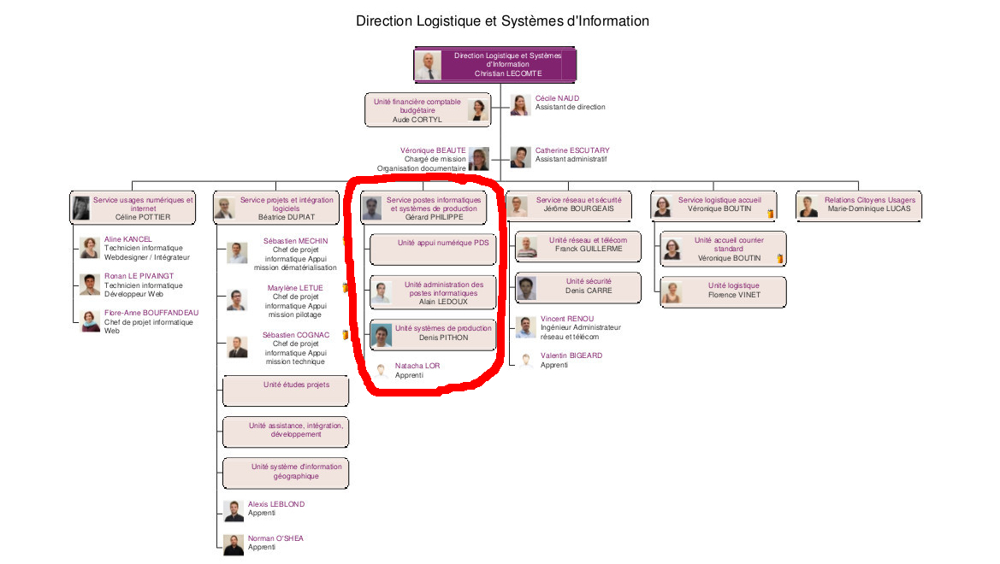
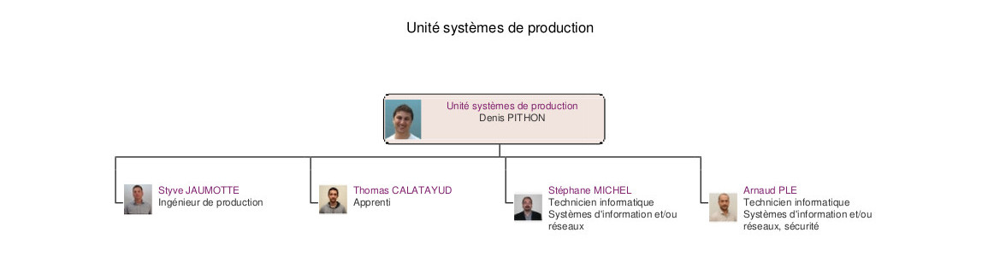

= Rapport d'apprentissage Master 1 - Informatique: Supervision open-source d'un système d'information
Thomas Calatayud <thomas.calatayud@etud.univ-angers.fr>
2016-2017
:description: Projet d'alternance de Master réalisé par {author}
:icons: font
:source-highlighter: coderay
:coderay-linemus-mode: inline
:toc: preamble
:toc-title: Table des matières
:toclevels: 3
:figure-caption: Image
:check: icon:check[role="green"]
:almost: icon:check[role="yellow"]
:uncheck: icon:times[role="red"]
:question: icon:question[role="blue"]
////
Pour enlever le toc en pdf
ifdef::backend-pdf[]
:toc!:
endif::[]
////

[.text-center]
Rapport rédigé par Thomas CALATAYUD +
Étudiant en Master Informatique à l'université d'Angers +
 +
 +
 +

[cols="<.^,>.^", frame="none", grid="rows"]
|===
|Responsable de stage +
M. Frédéric LARDEUX +
Enseignant chercheur +
LERIA, Université d'Angers +
frederic.lardeux@univ-angers.fr

|Tuteur en entreprise +
M. Denis PITHON +
Responsable de l'unité système de production +
Département de Maine et Loire +
d.pithon@maine-et-loire.fr
|===

== Remerciements

Je tiens, avant tout, à remercier mon tuteur en entreprise, M. Denis PITHON pour son expérience, son soutien et ses conseils avisés, ainsi que Arnaud, Styve et Stéphane. Ils ont été, pendant toute cette première année, mes principaux interlocuteurs, toujours présents pour me conseiller et m'accompagner en cas de problème. Ce sont aussi des personnes présentant d'importantes qualités humaines. C'est un plaisir de travailler toujours dans la bonne humeur avec eux. Je suis heureux d'avoir passé cette première année d'apprentissage avec eux et je suis très content d'avoir l'opportunité de continuer l'année prochaine à leur côté.

Je tiens de plus à exprimer toute ma reconnaissance à M. Gérard PHILIPPE, responsable du service Postes Informatiques et Systèmes de Production au sein du Conseil Départemental, pour m'avoir accueilli dans son équipe.

Je souhaite remercier Cécile qui a toujours été présente pour m'aider administrativement, pour son soutien, sa gentillesse et sa bonne humeur. Merci aussi à tous les membres de la Direction Logistique et Système d'Information pour tout ce qu'ils m'ont apportée tout au long de cette première année.

J'aimerai remercier M. Frédéric Lardeux, Enseignant à l'université d'Angers et chercheur au Laboratoire d'Etude et de Recherche en Informatique d'Angers, de m'avoir conseillé, accompagné tout au long de cette première année d'apprentissage. C'est son enthousiasme qui m'a donnée l'envie et l'opportunité d'obtenir ce poste d'apprenti.

Pour finir, j'aimerai aussi remercier mon ami et collègue Alexis Leblond pour sa présence et sa bonne humeur à la fois à l'université et au Conseil Départemental.

<<<

toc::[]

<<<

== Introduction

En sortant de ma License Informatique, je souhaitais continuer mon parcours vers un Master Informatique. Deux choix se sont offert à moi : continuer mes études dans un parcours orienté vers la recherche ou dans un parcours professionnalisant.

Mon premier choix était particulièrement porté vers le parcours recherche. Je me suis donc inscrit en première année de Master Informatique qui est générale aux deux parcours, dans l'optique de poursuivre sur une deuxième année en Master Intelligence Décisionnelle.

Il m'a été rappelé qu'il était notamment possible d'éffectuer ces deux années de Master en alternance en entreprise.

Malgrès ma passion pour les études, apprendre de nouvelles choses, la découverte et la recherche de nouveauté, l'idée d'effectuer ce Master en alternance m'a plutôt attiré, j'ai donc décidé de me lancer dans la recherche d'une entreprise, prête à m'accueillir et à m'offrir un sujet d'apprentissage qui puisse m'intéresser.

C'est à ce moment, qu'on m'a proposé une offre au Conseil Départemental de Maine-et-Loire. J'ai donc intégré le service Système de Production au sein de la Direction Logistique et Système d'Information en ayant pour projet de remettre à neuf le système de supervision. Pour cela on m'a demandé d'indentifier et de proposer une solution libre et open-source et éventuellement de la mettre en place.

J'ai finalement choisis l'apprentissage pour goûter à l'informatique dans un contexte professionnel. Cela me permet d'avoir un peu plus d'expérience professionnelle dans le domaine informatique. Et grâce à cette alternance je peux continuer d'étudier à l'université tout en apprenant de nouvelles chose au Conseil Départemental. Donc j'ai l'opportunité d'étudier et de travailler en ayant un salaire dans un domaine qui me plait. Et j'ai accepter ce sujet dans le but de découvrir l'administration système, un aspect de l'informatique que je ne connaissait pas beaucoup.

<<<

== Le conseil départemental de Maine-et-Loire

=== Présentation du conseil départemental

(Voir notes de la réunion d'accueil)
Qu'est ce que c'est ? Qu'est ce qu'il fait , Organisation ? (élus, administration teritoriale, directions, services ...)
- Une collectivité territoriale
- Missions/compétences
- Organisation

.Organigramme du Conseil Départemental
image::Images/Organigramme-CG.JPG[]

<<<

- La DLSI : qu'est ce qu'on fait ?
    - Les différents services
    - L'unité système de production

.Organigramme de la DLSI

<<<

=== L'unité Système de Production et ses missions

L'unité système de production travaille au sein de la DLSI du Conseil
Départemental de Maine-et-Loire sur les problématiques liées au stockage, à la
sauvegarde, à la virtualisation et à la supervision des matériels et
applications cotés serveurs, ainsi qu'a l'administration des systèmes Linux et
Windows.

Quoi ? missions ? chiffres ?
-> Stockage
-> Sauvegarde/restauration
-> Virtualisation
-> Administration système et bases de données
-> Gestion des profils/boite mail
-> SUPERVISION

.Organigramme du Service Poste Informatique et Système de Production
image::Images/Organigramme-SPISP.jpg[]

.Organigramme de l'unité Système de Production

<<<

==== La Supervision

//https://www.monitoring-fr.org/supervision/

La supervision est une fonction permettant d'indiquer, controler, commander l'état d'un système ou d'un réseau. Les outils de supervision remontent des informations techniques et fonctionnelles du système d'information. Le tout dans un but de détection et de traitement le plus automatique possible.

L'informatique est intégrée et est devenue un outil indispensable dans une entreprise, quel que soit son secteur d'activité, le système d'information est placé désormais au centre de l'activité de différentes entités métiers et doit fonctionner pleinement et en permanence pour garantir l'efficacité de l'entreprise. A tous les niveaux, les réseaux, les terminaux utilisateurs, les serveurs d'applications et toutes les données constituent autant de maillons sensibles dont la disponibilité et la qualité de service conditionnent le bon fonctionnement de l'entreprise.

Il existe deux enjeux majeurs pour les directions informatiques. Le premier est de garantir la disponibilité et les niveaux de service du système en cas de panne ou de dégradation des performances. Le second est de tenter de prévenir en cas de problème et, le cas échéant, garantir une remontée d'information rapide et une durée d'intervention minimale. Ces enjeux sont donc assurés par la supervision.

Ainsi, la supervision inclut plusieurs activités :

- Surveiller
- Visualiser
- Analyser
- Prévenir
- Piloter
- Agir
- Alerter

Elle permet de superviser l'ensemble du Système d'Information d'une entreprise :

- Le réseau et ses équipements
- Les serveurs
- Les périphériques
- Les applications
- Le workflow
- ...

<<<

==== Présentation de l'outil Nagios

//Supervision de serveurs, services, BD, environnement (Température, Luminosité, clim), équipement,...
//http://artisan.karma-lab.net/supervision-nagios

Nagios, qui s'appelait précédemment NetSaint, est un outil de supervision libre sous licence GPL. Développé en 1996, Nagios, s'architecture autour d'un moteur écrit en C. Il permet d'auditer en permanence des machines, des services sur ces machines, de recevoir des alertes en cas de problème et de disposer d'un tableau de bord de l'état du système à un moment donnée. C'est un programme modulaire qui se décompose en trois parties :

- Le moteur de l'application qui vient ordonnacer les tâches de supervision.
- L'interface web, qui permet d'avoir une vue d'ensemble du Système d'Information et des éventuelles anomalies.
- Les sondes (ou plugins), une centaine de mini programmes/scripts que l'on peut compléter, voir même créer, en fonction des besoins de chacun pour superviser chaque service ou ressource disponible sur l'ensemble des éléments du réseaux du Système d'Information.

Cet outil offre de nombreuse possibilités :

- Superviser des services réseaux (SMTP, HTTP, ICMP, ...)
- Superviser les ressources des serveurs (charge du processeur, occupation des disques durs, utilisation de la mémoire, ...) sur la majorité des systèmes d'exploitation.
- Superviser les équipements réseau (CPU, ventilateurs, ...)
- Superviser les Bases de données
- Superviser l'environnement (température, luminosité, humidité, climatisation, ...)
- Interface via le protocole SNMP
- Supervision à distance via SSH, agent NRPE.
- Remonter des alertes par mails, sms via un système de notification.
- Gestions d'utilisateurs (accèes liimité à certains utilisateurs)
- Les plugins sont écrits dans des langages de programmation les plus adaptés à leur tâche : scripts shell (bash, ksh, ...), C++, perl, Python, Ruby, PHP, C#, ... et il est possible de créer les siens.

<<<

=== Etude et mise en place d'une solution libre/open-source de supervision

Actuellement, la supervision de l'ensemble du système d'information est opérée par Nagios. Cette solution,
en place depuis près de 10 ans, contrôle un peu plus de 2700 points de
fonctionnement du SI (espaces disques, sites webs, bases de données,
consommations CPU, RAM ...).

[NOTE]
.Quelques éléments d'information concernant le système d'information :
====
Virtualisation sur oVirt (Linux/KVM)

* ~ 365 VMs (55% Linux, 45% Windows) réparties sur 42 serveurs physiques

* la moitié de ces VMs servent les applications métiers des 2500 agents

* Stockage NAS (NFS et CIFS) répliqué sur deux salles

* 18 To consommés pour les VMs sur un total de 40 To disponibles

* 21 To consommés pour la bureautique

* Supervision avec Nagios
====

.*Il m'est demandé dans le cadre de mon apprentissage de :*
. Identifier et comparer les solutions libres/open-sources de supervision
. Préconiser la solution la plus adaptée aux besoins de l'unité
. Mettre en place la solution de supervision retenue

<<<

=== Mon activité au sein de l'unité

==== Mise à niveau technique

Dans un premier temps, à mon arrivé, il m'a été conseillé de commencer par me mettre à niveau, pour gagner en compétences techniques et monter en puissance sur le système. On m'a donc proposé une série de petits exercices à difficulté progressive. Ils ont pour but de me faire progresser sur l'environnement Linux côté serveur et les outils qui lui sont habituellement associés et me familiariser avec l'administration système pour gagner en autonomie.

Avant tout, il a fallu que j'installe et je configure entièrement mon poste de travail sous Linux.

J'ai ensuite découvert l'outil Ovirt que notre unité utilise pour l'installation et la gestion de machines virtuelles, pour installer et configurer une machine virtuelle Windows.

.Ovirt

===== Monter un disque virtuel

On m'a ensuite demandé de construire et monter un disque virtuel de 500 Po sur mon poste. Il a donc fallu que je trouve un moyen de créer un disque réellement utilisable de 500 Po. Il s'est avéré que désormais, le système d'exploitation empêche de manipuler des volumes aussi gros. J'ai donc pu monter un disque d'une taille seulement de 15 To, ce qui reste un disque conséquent.

[[app-listing]]
[source,shell]
----
tcalatayud@tcalatayud-CD49:~$ df -lh
...
/dev/loop0       15T  6,3M   15T   1% /media/tcalatayud/e9567653-9578-4332-b449-37eb63cabc7b # <1>
...
----
<1> J'obtiens donc un disque d'une taille de 15 To sur lequel je peux écrire et lire des fichiers. Cependant, il est bien entendu évident qu'avant de pouvoir le remplir complètement je risque d'avoir quelques problèmes étant limité par la taille du disque dur physique.

===== Script d'alertes mail, inotify

Il m'a ensuite été proposé, d'écrire un script permettant de transmettre un fichier par mail lorsqu'il apparaît dans un répertoire donnée, puis le supprimer. Il s'aggit donc d'éffectuer la surveillance d'un répertoire et de rapporté par mail tout ce qu'il s'y est passé.

Dans un premier temps j'ai écrit un premier petit script en shell bash. Ce script transfère par mail un fichier donnée en paramètre s'il est dans le répertoire surveillé puis il le supprime une fois qu'il a été envoyé.

J'ai ensuite écrit une deuxième version, amélioré, utilisant le mécanisme inotify qui fournit des notification concernant le système de fichiers. Ce mécanisme permet de mettre en place des actions associés à l'évolution de l'état du système de fichiers. Les principaux événements qui peuvent être suviis sont :

- *IN_ACCESS* : Le fichier est accédé en lecture
- *IN_MODIFY* : Le fichier est modifié
- *IN_CLOSE_WRITE* : Le fichier est fermé après avoir été ouvert en écriture
- ...

Et enfin, j'ai écrit une dernière version en Python3 qui s'éxecute en tant que daemon, c'est à dire que le programme s'éxecute en tâche de fond par le système, sans le contrôle de l'utilisateur.

J'y ai inclus la gestion de logs pour qu'on puisse avoir un rapport, si nécéssaire, des actions que le script a éffectué et pour permettre d'avoir un apperçu du bon fonctionnement et de la bonne éxecution du programme.

J'ai notamment utilisé un fichier de configuration .ini qui permet de définir à l'utilisateur et de rassembler des variables dans un même endroit pour pouvoir les utiliser ensuite dans le programme.

[[app-listing]]
[source,ini]
.script.ini
----
[config_mail]
fromaddr = t.calatayud@maine-et-loire.fr # <1>
toaddr = t.calatayud@maine-et-loire.fr # <2>
server = smtp.cg49.fr # <3>
port = 25

[config_inotify]
watchFolder = /home/tcalatayud/sendMailPython/dossier # <4>

[config_daemon]
pidfile = /home/tcalatayud/sendMailPython/daemon.pid # <5>
logfile = /var/log/MyLog/MyScriptDaemon.log # <6>
----
<1> Adresse mail de l'expéditeur
<2> Adresse mail du destinataire
<3> Serveur smtp
<4> Chemin du répertoire surveillé
<5> Chemin du fichier où on retrouve l'id du processus
<6> Chemin du fichier de log

Pour l'éxécuté, il suffit de lancer le programme avec l'argument "start". On l'arrête avec l'argument "stop". Il est possible d'obtenir les informations concernant le statut du programme avec l'argument "status".

==== Découverte, déploiement, installation et configuration de l'outil Nagios

Dans la continuité de cette mise à niveau, j'ai commencé à jeter un oeil sur l'outil nagios, à voir comment il fonctionne, comment l'installer, comment le configurer, comment l'utiliser.

////
.How to install nagios4
image::Images/nagios4.jpg[link="https://www.digitalocean.com/community/tutorials/how-to-install-nagios-4-and-monitor-your-servers-on-ubuntu-14-04"]
////

J'ai donc décidé, pour prendre en main cet outil complexe et puissant, d'installer et de configurer ma propre version de Nagios.

Il m'a donc été nécéssaire d'abord, de configurer un serveur pour pouvoir le déployer. J'ai donc installé et configuré une nouvelle machine virtuelle sous CentOS grâce à l'outil Ovirt. Puis je me suis lancé dans l'installation du Nagios en suivant la documentation, sur lequel j'ai configuré quelques sondes pour comprendre leurs fonctionnement.

Pour fonctionner, Nagios est basé sur un système de fichiers de configuration. Ces fichiers de configuration sont situés dans le dossier _/usr/local/nagios/etc/_ et classés sous forme de contact, d'hôtes, de services et de commandes.

Les contacts sont les différents utilisateurs de l'outils. On peut leur attribuer différents degrés de droit d'accès, définir une adresse mail, les périodes de notifications, ...

Les hôtes sont les différents serveurs, équipements en réseaux que l'on supervise. Il est impératif de lui définir l'adresse IP à laquelle l'hôte est affecté sur le réseau.

Pour chaque hôtes on définit les différents services à superviser en lui précisant la commande à éxecuter et en précisant les différents arguments si nécéssaire. Ils remontent via les commandes et les checks l'état dans lequel ils sont. Classiquement, on reconnait trois types d'états pour les services :

- *OK*
- *WARNING*
- *CRITICAL*

Les checks sont les scripts éxécutées par les commandes des différents services qui vont permettre de récupérer les données nécéssaires pour indiquer et mettre à jours l'état de ces services.

Dans un premier temps il a fallut que je configure un contact pour y déclarer principalement l'adresse mail sur laquelle je compte recevoir les alertes.
[[app-listing]]
[source,cfg]
.contacts.cfg
----
define contact{
        contact_name                        nagiosadmin             ; Short name of user
        use                                 generic-contact         ; Inherit default values from generic-contact template (defined above)
        alias                               Nagios Admin            ; Full name of user

        email                               t.calatayud@maine-et-loire.fr   ; <<***** CHANGE THIS TO YOUR EMAIL ADDRESS ******
        service_notification_period         24x7
        service_notification_options        w,u,c,r,f,s
        service_notification_commands       notify-service-by-email
        host_notification_period            24x7
        host_notification_options           d,u,r,f,s
        host_notification_commands          notify-host-by-email
        }
----

Dans un second temps, j'ai rajouté les différents hôtes que je souhaite superviser.
Voici un éxemple d'hôtes que j'ai configurer. C'est le serveur hébergeant le site web interne prévu pour les agents du département.
[[app-listing]]
[source,cfg]
.hosts/melinfo.cfg
----
define host {
        use                     generic-host                    ; Inherit default values from a template
        host_name               melinfo                         ; The name we're giving to this host
        alias                   Melinfo                 ; A longer name associated with the host
        address                 10.100.49.110                   ; IP address of the host
        hostgroups              linux-servers
        check_interval          5
        retry_interval          1
        check_command           check-host-alive
        max_check_attempts      10
        contact_groups          admins
        register                1
}
----

Ensuite, il faut configurer les services liés à chaque hôte, les données que je souhaite superviser.
[[app-listing]]
[source,cfg]
.services/melinfo_service.cfg
----
define service {
        use                     generic-service
        host_name               melinfo
        service_description     HTTP
        check_command           check_http
        notifications_enabled   0
} # <1>

define service {
        use                     generic-service
        host_name               melinfo
        service_description     PING
        check_command           check_ping!100.0,20%!400.0,90%
} # <2>
----
<1> Ce service va utiliser un check, une commande qui va envoyé une requête http dans le but de savoir si oui ou non le serveur web répond.
<2> Ce service va utiliser un check qui va remonter le temps de réponse, le ping. Cette commande est configuré de sorte à ce que si le temps de réponse dépasse 100 ms il se placera dans l'état WARNING. Si le temps de réponse dépasse 400 ms il se placera dans l'état CRITICAL.

Voici quelques éxemples de commandes utilisant des checks définit par Nagios.
[[app-listing]]
[source,cfg]
----
define command{
        command_name    check_http
        command_line    $USER1$/check_http -I $HOSTADDRESS$ $ARG1$
        }

define command{
        command_name    check_ping
        command_line    $USER1$/check_ping -H $HOSTADDRESS$ -w $ARG1$ -c $ARG2$ -p 5
        }

define command {
       command_name     check_local_disk
       command_line     $USER1$/check_disk -w $ARG1$ -c $ARG2$ -p $ARG3$
}
----

Il est possible avec Nagios de créer des templates ou groupes pour les contacts, hôtes et services. Ces templates permette d'uniformiser les configurations de contacts, hôtes et services qui se ressemblent pour pouvoir les déclarer plus simplement les prochaines fois.

Avec cette méthode de configuration, sous forme de fichiers, il est important pour garder un environnement propre et pour permettre une maintenance plus simple, de bien gérer l'arborescence de tous ces fichiers de configurations. Dans le cas contraire on se retrouve rapidement perdu et on risque de ne plus savoir où ont été rangé les fichiers pour pouvoir les modifier si nécéssaire.

On obtient un Nagios configuré et pret à superviser. On peut désormais se diriger vers l'interface web pour avoir enfin l'apperçu de notre système de supervision.
_http://xthomasnagios2/nagios/_ (où xthomas2 est la résolution dns de l'adresse ip de mon serveur sur le réseau)

.Services Nagios

==== Synchronisation des nagios de l'unité

Pour l'unité, deux serveurs Nagios sont installés, un serveur principal et un deuxième Nagios secondaire. On m'a demandé dans le cas d'une panne du serveur principal de pouvoir synchroniser sa configuration sur le Nagios secondaire.

J'ai donc écrit un programme s'éxécutant en tant que service système, c'est à dire un démon système géré par le protocole systemd. Utilisable via la commande systemctl, ce petit programme utilise, dans la même optique que le script d'envois de mail que j'ai écrit, le système inotify pour surveiller le répertoire de configuration de Nagios. Lorsqu'il repère un changement, il va transférer au Nagios secondaire, une archive contenant la configuration du Nagios principal, permettant ainsi d'avoir toujours la dernière configuration bien à jours. Ainsi, si le Nagios principal tombe en panne, sa configuration sera disponible sur le second nagios. Il ne restera plus qu'à extraire l'archive dans le dossier de configuration et relancer le Nagios pour prendre en compte les modifications.

==== Mise en place de la nouvelle salle serveur et installation de baies de stockage.

Pour répondre aux besoins grandissant du conseil départemental, l'ouverture d'une nouvelle salle de serveurs a été nécéssaire. En effet, pour assister les trois autres salles déjà en place, dont une sur le site de Frémur, une sur le site de Lavoisier et une dernière dans nos locaux du centre ville, une 4ème salle sur le site de Frémur à été mise en place en collaboration avec le département de la Sarthe et notamment la ville du Mans. J'ai donc assisté aux travaux et à son installation.

J'ai notamment assisté à l'installation de l'outil Ovirt pour ce nouveau réseau et j'ai moi même mis en place le Nagios.

En parallèle à cette installation, j'ai aussi pu aider à mettre en place sur le site de Lavoisier de nouvelles baies de stockages.

Grâce à ces interventions, j'ai pu constater qu'un administrateur système n'est pas seulement un informaticien qui règle les problèmes derrière son bureau, mais c'est aussi un technicien qui doit répondre à des questions techniques concernant le matériel et qui doit s'assurer le bon déploiement et le bon fonctionnement du matériel qu'il utilise.

<<<

== Identification des solutions libres/open-sources de supervision

Comme décrit dans l'intitulé de mon projet d'apprentissage, notre service utilise donc l'outil Nagios pour la supervision.

Malgrès son énorme catalogue de possibilité, cette solution qui a déjà plus de 20 ans devient vieillissante. Son système de configuration rend sa maintenance plutôt laborieuse et des problèmes de compatibilité peuvent parfois survenir sur certains niveaux, notamment au niveau de certains plugins, lors des mises à jours.

De plus, vu le manque de réactivité du développeur principal de Nagios et sa volonté de ne plus diffuser tous les modules sous licence libre, de nombreux développeurs actifs sur le projet ont fait diverger Nagios. Ainsi, des tas d'outils plus ou moins similaire à Nagios ont émergé.

S'ouvre donc l'éventualité et la curiosité de voir et découvrir ces nouvelles solutions.

C'est de cette volonté, que mon équipe a souhaité m'engager pour éffectuer cette mission.

=== Instantanné des solutions libres/open-sources.

////
Premier critère : Libre/Open-source

- Inventaire exhaustif
- Donner les différents types de solutions
- Les protocoles utilisés
- Les types de configuration
- Remontée des alertes
- ...
////

Pour trouver une nouvelle solution de supervision, il était nécéssaire de connaître les enjeux de la supervision, de connaître les solutions existantes sur le marché et ce qu'elles proposent. J'ai donc décidé dans ma démarche, de commencer mes recherches sans faire l'état de la solution éxistante, sans identifier les réels besoins de l'unité.

J'ai en effet choisi de faire un inventaire le plus exhaustif possible, faire la recherche et l'exploration la plus complète possible et la plus "naïve" possible, avec un regard neuf sur la supervision. L'idée était que grâce à ce regard neuf, je pourrai être capable d'identifier un maximum de solutions sans être influencé par nos besoins. De ce fait, je pourrais potentiellement tombé sur une solution, certe remplissant nos besoins, mais aussi trouver d'autres utilités tout aussi intéréssantes voir même plus intéréssantes.

Le seul critère de recherche que je me suis réellement imposé lors de cet inventaire est le fait que la solution soit open-source ou plus généralement gratuite.

C'est donc dans cette optique, que j'ai pu commencer mes recherches.

Durant cette profonde exploration, j'ai pu inventorier une énorme quantité de solution. En effet, pas moins de 72 solutions sont ressorties, toutes plus ou moins intéréssantes.

Par le biai de ces recherche j'ai pu distinguer différents types de supervision :

- *La supervision technique* : Elle se sépare en deux sous catégorie.
..  *La supervision réseau* : On entend ici l'aspect communication entre les machines. Elle va consister à s'assurer le bon fonctionnement des comminications et de la performance des liens (débit, latence, taux d'erreurs). C'est dans ce cadre que l'on va vérifier par exemple si une adresse IP est toujours joignable, ou si tel port est ouvert sur telle machine, ou faire des statistiques sur la latence du lien réseau.
..  *La supervision système* : Elle va consister à surveiller les machines elles-mêmes et en particulier ses ressources. Si l'on souhaite par exemple contrôler la mémoire utilisée ou la charge processeur sur le serveur, voir analyser les fichiers de logs système.
- *La supervision applicative ou métier* : Plus subtile, Elle va consister à surveiller les applications et les processus métiers des agents au sein de l'entreprise.

Pour résumer, la supervision va dépendre principalement de l'activité de l'entreprise mais aussi et surtout de son besoin. On trouve rarement un même type de supervision d'une entreprise à l'autre. Mais cela reste abstrait. Concrètement et généralement, on supervise les serveurs, les switchs, les routeurs, les téléphones en réseau, les caméras en réseau, les badgeuses, les sondes, la bande passante, le CPU, la mémoire, les disques, les processus, les services, les bases de données, le bon déroulement des actions (backups, transferts, ...). Tout est supervisable tant que l'on peut récupérer et analyser des informations provenant des différents équipements que l'on souhaite superviser.

Un système de supervision est basé généralement sur un serveur centrale. On y retrouvera assez souvent les fonctions suivantes :

- Interroger un agent installé directement sur l'équipement à surveiller, pour avoir une vue de l'intérieur du système.
- Interroger chaque service ou équipement directement depuis la base centrale, pour avoir une vue de l'extérieur du système.
- recevoir les alertes émises par les équipements et les retransmettre.
- Notifier les administrateurs.
- Agir pour remettre en service
- Archiver les données récoltées et produire des rapports statistiques ou graphiques.
- Permettre de visualiser l'état du système d'information.

Le tout est que ces tâches soit éffectuées le plus automatiquement possible pour libérer cette charge de travail à l'administrateur.

Il est possible d'accéder à de nombreuses informations localement sur une machine en utilisant des outils "bas niveau". En quelques lignes de script shell par éxemple, on peut construire un rapport d'état de la machine. On rajoute une entrée dans la crontab et la supervision locale peut être assurée. De nombreuse lignes de commandes sont aussi disponibles pour avoir un rapide apperçu de l'état d'un système. La commande ping, par éxemple pour tester si une machine est connectée au réseau. Ou encore, la commande free, pour visualiser la mémoire, ...

En parallèle, il y a l'IPMI, Intelligent Platform Management Interface. IPMI est une spécification commune à la plupart des constructeurs, permettant de superviser une machine, indépendamment de son sytème d'exploitation, y compris si elle est éteinte mais connectée à une prise électrique.

Le coeur d'IPMI est un contrôleur appelé BMC (Baseboard Management Controller). Il surveille les différents capteurs intégrés à la carte mère, comme la température, la vitesse de rotation des ventilateurs, l'état du système d'exploitation, ... et permet certaines actions sur la machine comme l'extinction ou le démarrage.

ICMP est un protocole de couche réseau qui vient palier à l'absence de message d'erreur du protocole IP. En effet, s'il y a un incident de transmission, les équipements intermédiaires vont utiliser ce protocole pour prévenir la machine émettrice. Les paquets ICMP sont encapsulés dans des paquets IP, et peuvent contenir des bouts de paquets IP pour citer celui ayant généré l'erreur. Afin de catégoriser les erreurs, elles sont divisés en types eux-mêmes parfois redivisés en codes. C'est un protocole très simple, qui n'a pas pour fonction directe la supervision d'un réseau mais qui est utilisé comme source d'information sur la qualité du réseau ou sur la présence d'une machine.

Un autre protocole très utilisé, voir indispensable dans la supervision, le SNMP, Simple Network Management Protocol, est principalement utilisé pour superviser des équipements réseaux, des serveurs ou même des périphériques tels que des baies de stockages de disques, des sondes météorologique, des onduleurs, ...

Le protocole SNMP est basé sur trois éléments :

- Un équipement à superviser qui contient des objets à gérer, des informations de configuration, des données techniques, des statistiques, ...
- Il exécute un agent, un programme qui agrège les données locales.
- Une console de supervision qui permet d'interroger les agents accessibles par le réseau ou de recevoir des alertes émises par les agents via des ports UDP (User Datagram Protocol).

Le protocole Syslog est aussi un outil très utile pour la supervision. C'est un protocole de transmission d'événements systèmes. Il permet de centraliser les événements systèmes de chaque serveur ou équipement réseau sur une seule machine pour des fins d'analyse statistique, d'archivage ou production d'alertes. Retrouvé dans les journaux, logs, chaque événement système est accompagné de son type de service, sa gravité, la date et l'heure à laquelle l'événement est survenu, et l'hôte sur lequel l'événement s'est produit.

De nombreux autres protocoles sont utilisés, comme JMX, CIM, ITIL, SBLIM, WBEM, ... mais tous les citer et les expliquer serait beaucoup trop long. C'est pour cela que je ne présente que les plus importants, ceux qui sont les plus utilisés sur les différentes solutions de supervision.

En supplément de ces protocoles, les solutions de supervision sont souvent accompagnées d'outils ou de logiciels de suivi graphiques. En effet, une fois les données récupérées, il est souvent intéréssant de les visualiser. Généralement, la meilleure façon de visualiser ces données, c'est de les représenter sur des graphiques. Pour ça, les outils de supervision comme MRTG, Munin, Ganglia, Cacti, ... utilisent dans la majeure partie du temps, une suite d'utilitaires de création de graphes basés sur des statistiques temporelles appelé RRDtool. Cet outil de gestion de base de données RRD (Round-Robin database) devenu incontournable, est utilisé pour la sauvegarde de données cycliques et le tracé de graphiques. C'est un outil idéal pour superviser des données serveurs, telles la bande passante ou la température d'un processeur.

.Graphique RRDtool
image::Images/Rrd_week.png[]

Mais il éxiste d'autres outils permettant de stocker et transformer les données en graphiques : Graphite, Kibana, ou encore Grafana, un outil très simple d'utilisation et entièrement configurables permettant de rendre un visuel ésthétique et lisible sur une large variété de données.

Lorsque le système d'information s'élargit, lorsqu'il commence à prendre de l'ampleur et qu'on doit superviser un grand nombre d'hôtes et de services. Il devient nécéssaire, voir indispensable d'avoir un apperçu global de l'état de ces hôtes et de ces services. En effet, pouvoir voir d'un rapide coup d'oeil les données supervisées le plus synthétiquement et globalement possible, semble être un enjeu important.

Beaucoup de solution mise d'ailleurs sur ce point. Certaines proposent des interfaces généralement déstiné pour le web, sophistiquées, permettant justement cet apperçu global de l'état des hôtes et des services supervisés. Elles incluent généralement des tableaux de bords configurable à souhait, nous offrant la possibilité de choisir les vues qui nous importent les plus, souvent accompagnées par les graphiques adéquats.

D'autres solutions préfèrent se concentrer sur le moteur de la supervision, laissant place parfois à des tiers la possibilité de développer leur propre interface qu'ils partagent ensuite à la communauté. Ainsi, par éxemple, pour Nagios, on retrouve en parallèle à son interface web simpliste, des versions parfois plus évolués et plus ésthétiques développées et mises à disposition par la communauté.

De cet inventaire, on constate des fonctionnalités ressortant sur la plupart des solution. Ces fonctionnalités, que l'on pourrait qualifiées parfois d'indispensables pour la supervision semble former des critères important dans le choix d'une bonne solution de supervision, comme la nécéssité d'un protocole SNMP, d'alertes, d'interface web, ...

<<<

=== Etablir les critères de sélection

On peut donc s'apercevoir grâce à cet inventaire, qu'il existe énorméement de solutions toutes aussi diverses les unes que les autres. Cependant, il semble bien évidemment impossible de tester ces 72 solutions en profondeur et juger de leur véritable potentiel même si elles ne sont pas toutes intéréssantes compte tenu de nos besoins. Il est donc nécéssaire de réduire cette liste.

J'ai donc commencé à faire un premier filtrage et à réduire drastiquement la liste des solutions établies. Je suis ainsi passé d'une liste de 72 solutions à une liste d'une dizaine de solutions. Ces 10 solutions se sont démarquées principalement par mon analyse personnelle de nagios et des discussions avec les membres de l'équipe.

Mais une liste de 10 solutions semble toujours autant compliqué à évaluer et à tester de fond en comble. Malgrès mon envie de vouloir tester le plus de solution possible, l'équipe et moi avons décidé de n'en retenir que deux. Pour les identifier, il est nécéssaire de savoir lesquels sont les plus intéréssantes selon nos besoins.

C'est ainsi qu'est apparu la nécéssité d'établir un ensemble de critère définissant si telle ou telle solution est plus intéréssante qu'une autre. Ainsi, à l'image d'un tamis, les critères que j'aurai établi pourront filtrer les solutions restantes en faisant ressortir les deux meilleures.

C'est à partir de maintenant, qu'il a été indispensable de bien identifier les besoins de l'unité. En effet, pour construire ce filtre il a fallu dans un premier temps, bien cerner le domaine à superviser. J'ai donc parcouru les Nagios déjà installés pour bien identifier et lister les différentes sondes mises en place. Dans un second temps, j'ai repris les solutions restantes du premier filtrage pour les croiser entre elles et identifier dans l'ensemble ce qui les caractérise vraiment. En parallèle, de nombreuses discussions avec l'équipe m'ont permi d'établir une liste de 25 critères que j'ai classé selon trois catégories : les critères impératifs, souhaitables ou bonus.

include::../recherches/criteres.adoc[]

Une fois validé par l'équipe, j'ai pu utiliser ces critères et les croiser avec les solutions envisageables dans un tableau. C'est donc ce tableau qui me sert de filtre pour identifier par lui même et de manière naturelle les meilleures solutions. Ils va donc les classer et faire ressortir visuellement les solutions que je vais pouvoir tester.

.Tableau comparatif des solutions en fonction des critères
image::Images/Comparatif.png[]

{check} : Possible +
{uncheck} : Impossible +
{question} : Pas d'informations

On peut donc rapidement juger quelles sont les solutions les plus intéréssantes par un code couleur intuitif : vert indique que le critère est respecté, jaune indique que le critère est respecté sous certaines conditions (par éxemple via un plugin) et rouge indique que le critère n'est pas respecté.

J'ai aussi généré deux graphiques permettant de mieux comparer de façon plus quantifié.

.Graphique représentant les solutions en fonction des critères
image::Images/diagram.png[]

Plus la solution présente de vert, plus elle aura de critères validés et totalement intégrés. +
Plus la solution présente de jaune, plus elle aura besoin de module/plugins supplémentaires à installer. +
Plus la solution présente de rouge, plus elle aura de critère non validés. +
Les solutions présentant du bleu sont des solutions où je n'ai pas trouvé d'information concernant certains critères.

.Graphique représentant les solutions en fonction des critères classés selon leur importance.

Ce second graphique reprend le principe du premier graphique, en précisant les différentes catégories de critères (Imépratif, souhaitable, bonus). Ainsi, on peut voir d'un rapide coup d'oeil quelle solution rempli les critères les plus important. Ce graphique permet de faciliter l'identification des deux meilleures solutions.

<<<

=== Présentation des solutions sélectionnées

Transition critère et choix des solutions.

Présentation des 2 solutions : carte d'identité des solutions

==== Solution 1

==== Solution 2

== Bilan

Synthèse et ouverture
Mon ressenti ce que j'ai apporté, ce qu'on m'a apporté

Cette première année d'apprentissage au Conseil départemental a dans un premier temps été l'occasion pour moi d'avoir une première expérience de travail dans un contexte qui me plait vraiment : l'informatique. En effet les jobs étudiants que j'ai pu avoir dans le passé notamment dans la restauration n'ont pas été sans intêret et m'ont beaucoup appris. Mais ce n'est rien comparé à une expérience de travail dans le domaine qui m'intéresse et dans lequel j'aimerai vraiment travailler.

De plus, j'ai pu découvrir un domaine de l'informatique que je ne connaissais pas : l'administration système. En effet, mon apprentissage m'a permis de découvrir un nouveau sujet de l'informatique et m'a permi d'acquérir des connaissances complémentaires à celles acquises à l'université. Ma nature très curieuse fait en sorte que j'aime énormément apprendre et découvrir de nouveaux sujets, ce qui a été possible grâce au poste que l'on m'a proposé au Conseil Départemental.

J'ai pu non seulement découvrir en profondeur un sujet précis de l'administration système : la supervision, mon projet d'apprentissage, mais aussi, en cottoyant et en travaillant avec les autres membres de mon unité, j'ai pu découvrir d'autres problématiques de l'administration système, comme la virtualisation, le stockage et la sauvegarde. J'ai aussi pu ajouter quelques notions de réseau et de sécurité. Toutes ces nouvelles connaissances acquises me permettront ainsi de m'ouvrir au domaine de l'administration système et de ne plus me restreindre au monde du développement largement étudié à l'université.

J'ai rencontré quelques difficultés techniques au début de mon apprentissage, jsutement dues au fait que je n'avais jamais vraiment travaillé sur le domaine de l'administration système auparavent. Mais j'ai rapidement surmonté ces difficultés par une légère et rapide remise à niveau notamment grâce aux exercices proposés par mon tuteur. Ainsi, j'ai rapidement pu me mettre au travail en autonomie et commencer le projet de supervision.

Concernant mon projet de supervision, un premier cap a été franchis. En effet, dans un premier temps, j'ai pu comme il m'a été demandé, identifier le plus exhaustivement possible les solutions libres de supervision existantes. Puis pour définir les solutions les plus intéréssantes à tester, j'ai établis une liste de critères en me basant sur le système existant, sur les demandes et besoins de l'unité tout en rajoutant mon opinion personnelle. Une fois ces critères établis, j'ai pu les croiser avec les solutions que j'avais trouvé pour qu'ils puissent agir de filtre et pour que je puisse ensuite réperer rapidement quelles solutions il faut retenir et tester. Chacune de ces étapes que j'ai méthodologiquement établis ont été suivi de près et progressivement validé par l'équipe.

Pour la suite de mon apprentissage, maintenant que la première étape a été effectuée et validée, il me reste à tester, installer, configurer selon nos besoins sur les serveurs de tests, les deux solutions que nous avons retenu pour ensuite potentiellement, s'il y en a une qui est vraiment intéréssante, l'installer définitivement sur les serveurs de productions.

<<<

== Annexes

<<<

== Table des illustrations

<<<

== Sources

<<<

////
== Tâches éffectuées

====
* [x] Monté en puissance sur l'administration système et remise à niveau. _Dans le but de gagner en autonomie._
    - [x] installation et configuration complète de mon poste de travail
    - [x] disque virtuel
    - [x] inotify
    - [x] serveur apache
* [x] Création de VM (via ovirt) et configuration de serveur.
* [x] Découverte et prise en main avec création et configuration de nagios.
* [x] Projet de réplication de nagios.
    - [x] script shell
    - [x] inosync
* [x] Projet saeir, nouvelle salle avec création d'un ovirt suivi de la mise en place de son nagios.
* [x] Intervention Lavoisier montage des baies de stockage.
* [x] Recherche des outils de supervision
    - [x] link:../recherches/documentation.html[Documentation]
    - [x] link:../recherches/inventoring.html[Inventaire]
* [x] Etude du système Nagios actuellement installé.
    - [x] Reconnaissance des hotes et services supervisés
    - [x] Liste des sondes, checks installés (link:../nagios-2/config.html[Configuration])
* [x] Etude des solutions envisageables
    - [x] Identification des critères de sélection (link:../recherches/criteres.html[Critères])
    - [x] Tableau comparatif des solutions/critères (link:../recherches/comparatif.html[Comparatif])
* [ ] Proposition des solutions envisageable
* [ ] Etude des solutions sélectionnées
* [ ] Mise en place de la solution retenue
====
////
