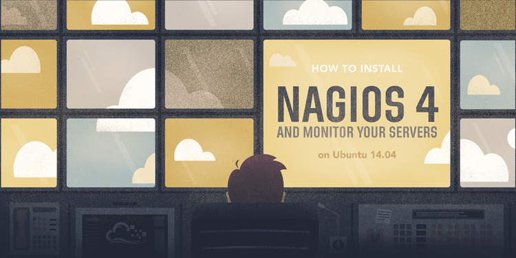

= Supervision open-source d'un système d'information
Thomas Calatayud <t.calatayud@maine-et-loire.fr>
:description: Projet d'alternance de Master réalisé par {author}
:icons: font
:source-highlighter: coderay
:coderay-linemus-mode: inline
:toc: macro
:toc-title: Table des matières
////
Pour enlever le toc en pdf
ifdef::backend-pdf[]
:toc!:
endif::[]
////

[.text-center]
Rapport rédigé par Thomas CALATAYUD +
Étudiant en Master Informatique à l'université d'Angers +

[cols="<.^,>.^", frame="none", grid="rows"]
|===
|Responsable de stage +
M. Frédéric LARDEUX +
Enseignant chercheur +
LERIA, Université d'Angers +
frederic.lardeux@univ-angers.fr

|Tuteur en entreprise +
M. Denis PITHON +
Responsable de l'unité système de production +
Département de Maine et Loire +
d.pithon@maine-et-loire.fr
|===
<<<

== Remerciements

////
à rédiger
////

<<<

== Table des matières
// voir TOC, choisir si j'utilise le miens ou le toc::[]

// voir pour l'ordre Introduction Présentation

. <<Remerciements>>
. <<Introduction>>
.. <<L' Administration système>>
.. <<La Supervision>>
. <<Présentation>>
.. <<Le Conseil Général de Maine-et-Loire>>
.. <<L' unité DLSI>>
.. <<Projet d' Apprentissage>>
.. <<Nagios>>
. <<Recherches>>
.. <<Solutions de supervision>>
.. <<Analyse du nagios mis en place>>
.. <<Identification des critères>>
. <<Etude des solutions>>
.. <<Choix 1>>
.. <<Choix 2>>
.. <<Choix 3>>
. <<Choix définitif>>
. <<Déploiement de la solution>>
. <<Conclusion>>
. <<Annexes>>
. <<Table des illustrations>>
. <<Sources>>

<<<

toc::[]

<<<

== Introduction

=== L' Administration système

https://www.opsview.com/it-monitoring-sysadmins

=== La Supervision

https://www.monitoring-fr.org/supervision/

La supervision est une fonction permettant d'indiquer, controler, commander l'état d'un système ou d'un réseau. Les outils de supervision remontent des informations techniques et fonctionnelles du système d'information. Le but est que ces informations soit détectées et traitée de manière automatique. 

<<<

== Présentation

=== Le Conseil Général de Maine-et-Loire

blablabla voir notes de la réunion d'accueil

=== L' unité DLSI

L'unité système de production travaille au sein de la DLSI du Conseil
Départemental de Maine-et-Loire sur les problématiques liées au stockage, à la
sauvegarde, à la virtualisation et à la supervision des matériels et
applications cotés serveurs, ainsi qu'a l'administration des systèmes Linux et
Windows.

<<<

=== Projet d' Apprentissage

Actuellement, la supervision de l'ensemble du système d'information est opérée par Nagios. Cette solution,
en place depuis près de 10 ans, contrôle un peu plus de 2700 points de
fonctionnement du SI (espaces disques, sites webs, bases de données,
consommations CPU, RAM ...).

[NOTE]
.Quelques éléments d'information concernant le système d'information : 
====
Virtualisation sur oVirt (Linux/KVM)

* ~ 380 VMs (55% Linux, 45% Windows)

* la moitié de ces VMs servent les applications métiers des 2500 agents

* Stockage NAS (NFS et CIFS) répliqué sur deux salles

* 14 To consommés pour les VMs

* 15 To consommés pour la bureautique

* Supervision avec Nagios 
====

.*Il m'est demandé dans le cadre de mon apprentissage de :*
. Identifier et comparer les solutions libres/open-sources de supervision
. Préconiser la solution la plus adaptée aux besoins de l'unité
. Mettre en place la solution de supervision retenue

<<<

=== Nagios

Présentation de nagios blabla

<<<

== Recherches

=== Solutions de supervision

<<<

=== Analyse du nagios mis en place

<<<

=== Identification des critères

<<<

== Etude des solutions

=== Choix 1

<<<

=== Choix 2

<<<

=== Choix 3

<<<

== Choix définitif

<<<

== Déploiement de la solution

<<<

== Conclusion

<<<

== Annexes

<<<

== Table des illustrations

<<<

== Sources

<<<

////

Déroulement de l' apprentissage

////

== Tâches  

http://asciidoctor.org/docs/user-manual/#tables

====
* [x] Monté en puissance sur l'administration système.
    - [x] installation du linux, configuration réseaux...
    - [x] disque virtuel	
    - [x] inotify
    - [x] serveur apache
* [x] Création de VM (ovirt) et configuration de serveur. 
* [x] Découverte et prise en main avec création et configuration de nagios.
* [x] Projet de réplication de nagios.
    - [x] script shell
    - [x] inosync
* [x] Projet saeir, nouvelle salle avec création d'un ovirt suivi de la mise en place de son nagios.
* [x] Intervention Lavoisier montage des baies de stockage.
* [x] Recherche des outils de supervision
    - [x] link:../recherches/documentation.adoc[Documentation]
    - [x] link:../recherches/inventoring.adoc[Inventaire]
* [x] Etude du système Nagios actuellement installé.
    - [x] Reconnaissance des hotes et services supervisés
    - [x] Liste des sondes, checks installés (link:../nagios-2/config.adoc[Configuration])
* [ ] Etude des solutions envisageables
    - [x] Identification des critères de sélection (link:../recherches/criteres.adoc[Critères])
    - [ ] Tableau comparatif des solutions/critères (link:../recherches/comparatif.ado[Comparatif])
* [ ] Proposition des solutions envisageable
* [ ] Mise en place de la solution retenue
====

