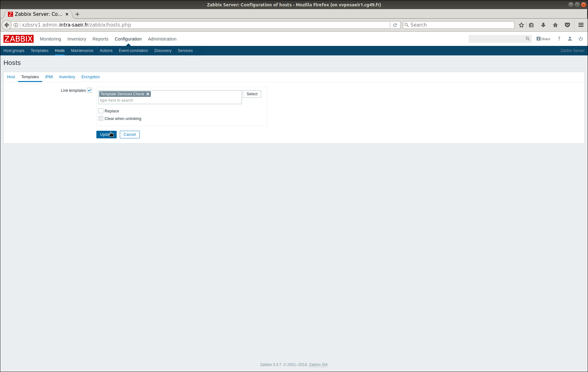
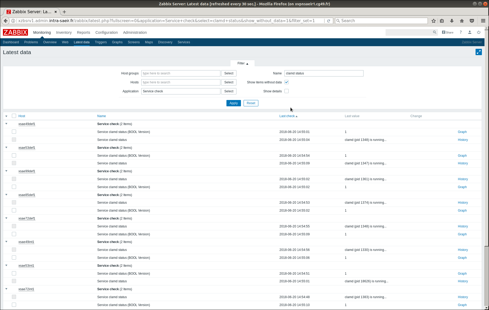

= Superviser les services
Thomas Calatayud <t.calatayud@maine-et-loire.fr>
:icons: font
:source-highlighter: coderay
:coderay-linemus-mode: inline

Dans le cadre de la supervision du SAEiR, il m'a été demandé de superviser certains services applicatifs s'exécutant sur les serveurs. Pour l'exemple nous allons superviser une application antivirus qui s'exécute en tant que service système linux. Cet antivirus est identifier par le système par : clamd.

== Solutions

=== UserParameters

Le _UserParamater_ est un paramètre propre à zabbix. Il permet d’exécuter n'importe quelle commande depuis un terminal par le biais de l'agent zabbix. L'agent zabbix peut récupérer le résultat de la commande exécuté et l'envoyer au proxy ou serveur pour y accéder sur l'interface de zabbix et ainsi pouvoir créer des items et triggers afin d'être notifié des problèmes lié à l'application en question.

==== Utilisation

La première étape est d'identifier la commande qui va nous donner les informations sur le statut du service.
Ici, nous utilisons la commande service fournit par linux.

[[app-listing]]
[source,shell]
----
tcalatayud@tcalatayud-CD49:~$ service clamd status
clamd (pid 1309) is running... <1>
----
<1> Nous pouvons voir ici que le service s’exécute correctement avec le pid 1309.

Maintenant que nous avons identifié la commande a utiliser il va falloir l'intégrer au fichier de configuration de l'agent zabbix /etc/zabbix/zabbix_agent.conf.
Nous rajoutons à la fin du fichier :

[[app-listing]]
[source,shell]
----
...
UserParameter=service.check[*],service $1 status <1>
----
<1> Nous indiquons ici que nous allons utiliser un UserParameter en précisant la clé d'identification : _service.check[*]_ permettant d'identifier la commande _service $1 status_ qui sera exécuté.

Après avoir redémarrer l'agent zabbix nous pouvons créer dans l'interface un nouvel item qui sera associé à ce UserParameter.

Dans l'onglet Configuration > Hosts sélectionner _Items_ de l'hôte voulu.

Choisir l'option _Create item_

. Préciser le nom de l'item.
. Choisir si l'agent zabbix est actif ou passif.
. Indiquer la clé du UserParameter que nous avons spécifié dans le fichier de configuration de l'agent zabbix en précisant le paramètre entre crochet. Ici, le paramètre correspond au nom du service et remplacera dans la commande _service $1 status_ le $1.
. Bien définir le type d'information, ici le résultat de la commande nous donne l'information sous forme d'une chaîne de charactère donc nous choisissons l'option _Text_.
. Nous pouvons choisir les options de rétention et d'historisation.
. Ne pas oublier de présicer l'application qui sera lié à cet item pour permettre d'identifier plus simplement l'item ou en créer une nouvelle.
. Appuyer sur le bouton _Add_ pour finaliser la création de l'item.

Nous avons créer un item qui nous indique si le service est bien lancé ou non. Cependant, cet item nous renvois une chaîne de charactère difficile à évaluer par un trigger nous allons donc transformer la réponse de cet item en entier qui sera beaucoup plus facile à évaluer. Si le service tourne il nous retournera 1 sinon il retournera 0. Pour modifier cet item revoyons le UserParameter. Nous allons rajouter toujours à la fin de notre fichier de configuration de l'agent zabbix.

[[app-listing]]
[source,shell]
----
...
UserParameter=service.check[*],service $1 status <1>
UserParameter=service.check-int[*],(service $1 status && echo "1" || echo "0") | sed -n 2p
----

Toujours de la même façon, nous allons recréer un nouvel item en définissant correctement le type d'information _Numeric (unsigned)_.

on obtient ainsi les deux items suivants :

Maintenant que l'item est créé nous allons créer un trigger qui lui sera associé et qui nous permettra de lever des alertes au cas où le service serait coupé. Pour cela nous devons retourner sur la page de sélection de l'hôte (Configuration > Hosts). Ici, nous sélectionnons _Triggers_ sur l'hôte en question.

Choisir l'option _Create trigger_

. Préciser le nom du trigger.
. Indiquer sa sévérité.
. Construire l'expression qui déclenchera le trigger. Pour cela, inscrire directement l'expression dans le champs ou appuyer sur le bouton _Add_.
+

+
.. Sélectionner l'item lié au trigger.
.. Indiquer la fonction. Ici on veut déclencer le trigger si la dernière valeur relevé par zabbix et 0. Pour cela on prend la fonction Las(most recent) T value is = N, où T est notre dernière valeur en question et N notre valeur 0 a indiquer dans la case _N_.
.. Appuyer sur le bouton _Insert_ qui va rajouter l'expression automatiquement dans notre trigger.
+
. Finaliser la création du trigger en appuyant sur le bouton _Add_

Nous avons maintenant notre service d'antivirus totalement supervisé sur l'hôte que nous souhaitions. Cependant, il pourrait être intéressant si nous voulons déployer ce couple d'item et de trigger sur plusieurs hôtes de créer un template regroupant les deux. Avec ce template la supervision du service serait déployable sur n'importe quel hôte.
Pour cela il suffit de créer un nouveau template dans Configuration > Templates en cliquant sur le bouton _Create template_.

On spécifie le nom du template et on créer le template en cliquant sur le bouton _Add_ et en ne pas oubliant de lui attribuer le groupe qui lui correspond ou en créer un nouveau.

Une fois le template créé il reste plus qu'à lui rajouter les items et triggers souhaités de la même méthode expliqué plus haut pour les hôtes.

Il ne reste plus qu'à assigné le templates à tous les hôtes nécéssaires. Ici nous allons comment assigner rapidement le template à des hôtes déjà existant.

Pour cela, dans l'onglet Configuration > Hosts

. Selectionner tous les hôtes et cliquer sur le bouton _Mass update_
+

+
. Dans l'onglet _Templates_, indiquer le template à ajouter.
. Cliquer sur le bouton _Update_ pour mettre à jour les hôtes.

Zabbix suppervise maintenant les services antivirus de tous nos serveurs.

== Conclusion

Pendant ce tutoriel nous avons appris à utiliser les UserParamater de zabbix dans le cadre de la supervision du service clamd. Mais, il est bien entendu possible et très simple d'adapté cette méthode pour superviser n'importe quel service en modifiant simplement lors de la création de l'item le paramètre entre [] de la clé du UserParameter. Il est aussi possible très simplement en modifiant dans le fichier de configuration zabbix la commande du UserParameter, de superviser n'importe quelle autre application à partir du moment où elle peut afficher son statut en ligne de commande.

Nous avons aussi appris à créer des items, des triggers et les inclure à un template pour le déployer sur plusieurs hôtes très rapidement.
