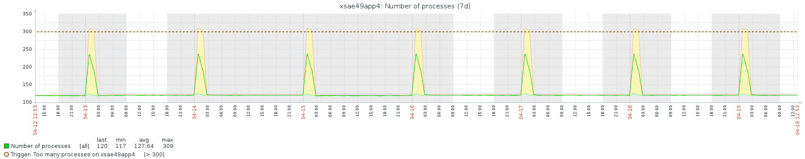
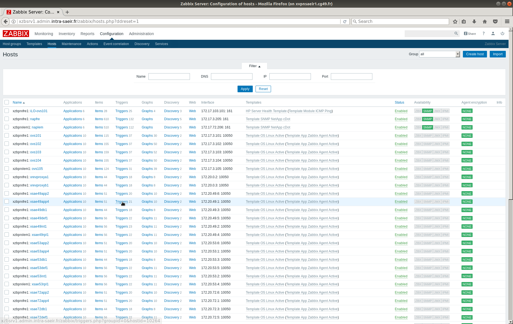
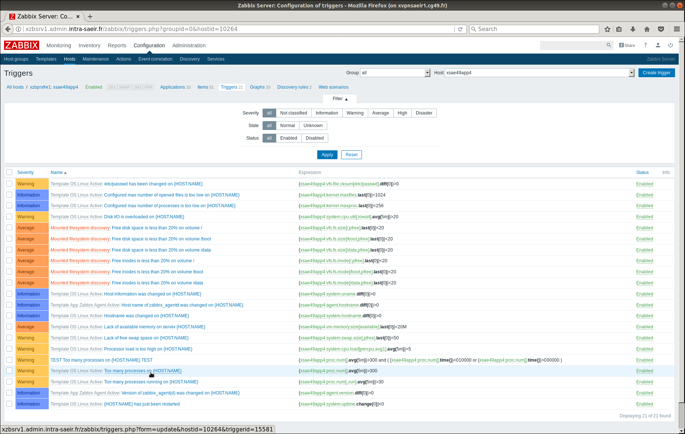
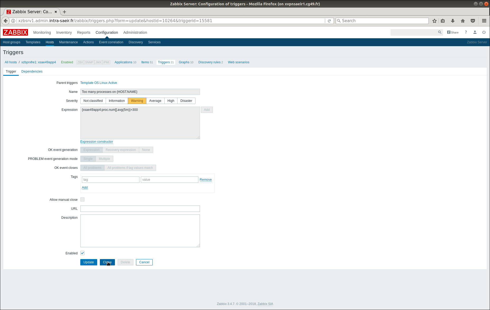
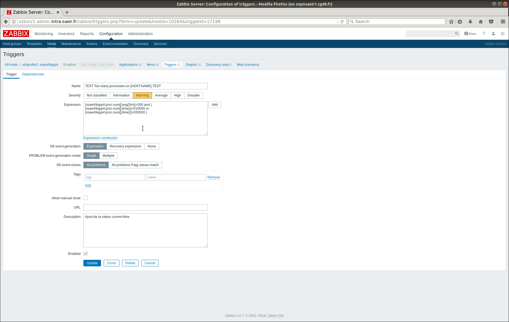
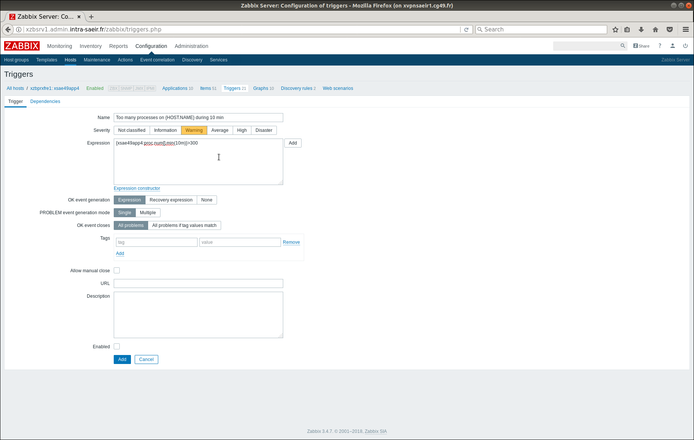
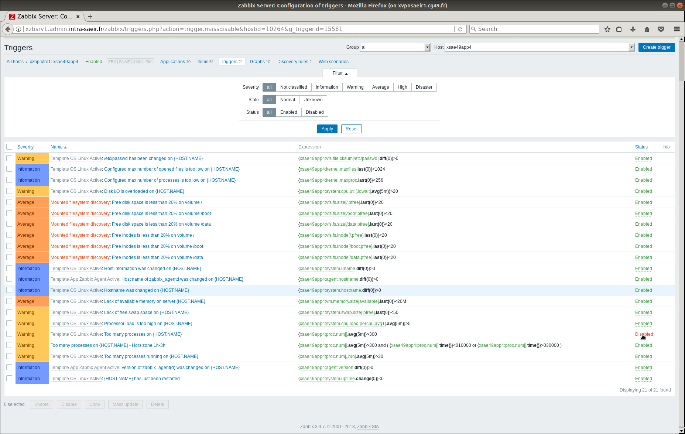

= Modifier un trigger
Thomas Calatayud <t.calatayud@maine-et-loire.fr>

Après l'installation d'un template sur un hôte, nous pouvons constater, comme sur le  <<graph,graphique>> ci-dessous, que régulièrement à la même heure, une alerte est levé par un trigger de zabbix. Après analyse du problème, on s'apperçoit que ce trigger est levé suite à une tâche que nous avons planifiée. Donc, nous souhaiterions ne pas recevoir d'alertes pour ce genre de problème dont nous sommes conscient, sans pour autant ne plus recevoir d'alertes si le même problème est relevé lors d'une autre période que nous ne contrôlons pas.

[[graph]]

== Solution

=== Modifier le trigger en question

Une solution est de modifier le trigger relevant cette alerte et faire en sorte qu'il ne la relève plus lors de cette période.

. Identifier l'hôte et afficher la liste des triggers
+

. Identifier le trigger levant l'alerte
+

. Cloner le trigger
+

Pour garder l'autre trigger intact en cas de nécéssité.

. Modifier l'expression
+

Cette expression va exclure le trigger pendant la période donnée.
+
*Ou encore*
+

Cette expression modifie le trigger pour lever l'alerte seulement si le pic dure plus de 10 minutes.

. Désactivé le trigger
+

On désactive le trigger original pour garder seulement le trigger que nous avons modififié.
