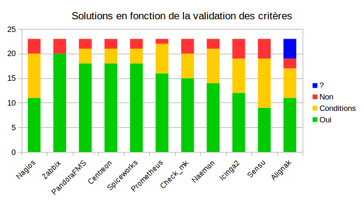

= Tableau comparatif des solutions en fonctions des différents critères
:icons: font
:check: icon:check[role="green",size="2x"]
:almost: icon:check[role="yellow", size="2x"]
:uncheck: icon:times[role="red", size="2x"]
:question: icon:question[role="blue", size="2x"]

{check} : Possible +
{uncheck} : Impossible +
{almost} : Possible sous conditions +
{question} : Pas d'informations

 

//{set:cellbgcolor:<color>}
//[red]#text in red#

[cols="<.^h,25*^.^a", options="header", width="100%"]
|===
| |Développement |Communauté |Support |Compatibilité nagios |Plugins |Licence |OS supportés |Configuration |Triggers/Alertes |Supervision distribuée (scalability) |Web API |Agentless |SNMP |Graphiques |Installation |Gestion des utilisateurs |Application Mobile |Trend prediction |Auto Discovery |Syslog |Isolement/Détection des problèmes |Desktop API |Map du réseau |Langages utilisés |Methode de stockage des données

|Nagios |2017-02-23 - v4.3.1 |Active |Semble abandonné pour la version Core |{check} |{check} |GPL - Sources disponibles mais features limité d'une version commerciale plus complète |Windows - Linux |Fichiers cfg - CLI |{check} - sms/mail |{check} |{check} - Non personnalisable directement |{almost} (via plugin) |{almost} (via plugin) |{almost} (via plugin) |Simple et rapide |{check} |{check} |{uncheck} |{almost} (via plugin) |{almost} (via plugins) |{uncheck} |{uncheck} |{check} |C |flatfile, SQL(NDOUtils), MySQL(nconf) 

|Zabbix |2017-02-27 - v3.2.4 |Active |Payant |{uncheck} |{check} - Possibilité de créer les siens |GPL |Windows - Linux | CLI - Configuration très simple depuis l'interface WEB |{check} - mail, sms, jabber, ez texting, Custom alertscripts |{check} |{check} - Personnalisable |{check} - FTP, IMAP, HTTP, HTTPS, LDAP, NNTP, POP3, SMTP, SSH, TCP, Telnet |{check} (SNMP et IPMI) |{check} - Intégrés |Simple |{check} |{check} |{check} |{check} |{check} |{check} |{uncheck} |{check} |C, php |MySQL, InnoDB, Oracle, PostgreSQL, SQLite, IBM DB2 

|Centreon |2017-01-30 -v3.4.1 |Pas très active (Mais excellente documentation) |Payant |{almost} (Nagios plus compatible à partir de la version 2.7 mais configuration basé sur le même système que Nagios |{check} - Nagios plus compatible à partir de la version 2.7/plugins centreon/Possibilité de créer les siens |GNU - GPL - Sources disponibles mais features limité d'une version commerciale plus complète |Windows - Linux |Fichiers cfg - CLI et API Web |{check} - sms/mail |{check} |{check} - Très complète (Graphes - Schémas) |{check} - SMTP, IMAP, HTTP, NNTP, PING |{check} |{check} - Intégrés |Simple et rapide |{check} |{check} |{check} |{check} |{check} |{check} |{uncheck} |{check} |C++ |MySQL, InnoDB 

|Naemon |2017-01-23 - v1.0.6 |Active via mailing list + forum Nagios |Actif via mail list |{check} |{check} - Nagios/Possibilité de créer les siens |GPL - Sources disponibles |Windows - Linux |fichier cfg (nagios configuration) - CLI - Web API |{check} - mail(intégré), sms, Twitter, Facebook, LinkedIn, Jabber, IRC, Audio alerts,... (via plugin) |{check} |{check} - Non personnalisable(Thruk) |{almost} (via plugin) - TCP, SSH, TELNET, NRPE, SQL,... |{almost} (via plugin) |{check} - Intégré (via Thruk) |Simple et ultra modulable |{check} |{almost} (non officiel) |{almost} (via plugin) |{check} |{almost} (via plugin) |{uncheck} |{uncheck} |{check} (via Thruk) |C |MongoDB, MySQL

|Sensu |2017-04-07 - v0.29 |Active via mailing list et IRC |Payant |{uncheck} |{check} - nagios/sensu/Possibilité de créer les siens |MIT - Sources disponibles |Windows - Linux |fichier json - CLI |{check} - mail, PagerDuty, Slack, HipChat, IRC, ... sms (via plugin) |{check} |{check} - Non personnalisable(Uchiwa) |{almost} (via plugin) |{almost} (via plugin) |{almost} (via Graphana) |Rapide mais beaucoup de module à installer |{check} |{almost} (non officiel) |{check} |{check} |{almost} (via plugin) |{almost} (via plugin) |{uncheck} |{uncheck} |Ruby |InfluxDB

|Check_mk |2017-04-12 - v1.5.0 |Active via mailing list + forum Nagios |Payant |{check} |{check} - Nagios/Possibilité de créer les siens |GPL - Sources Disponibles mais version commerciale plus complète |Windows - Linux |Fichier cfg (nagios configuration) - CLI |{check} - mail, sms |{check} |{check} - Non personnalisable (Multisite) |{almost} (via plugin) |{check} |{check} - Intégré |Simple et rapide (Installation nagios) |{check} |{check} |{uncheck} |{check} |{almost} (via plugin) |{check} |{uncheck} |{check} |C, Python |RRD

|Spiceworks |2017-02-10 - v1.4.0 |Active |GRATUIT |{uncheck} |{check} - Spiceworks/Possibilité de créer les siens |Gratuit - Non Open Source mais entièrement gratuit |Windows - Linux |Configuration depuis l'API |{check} - mail, sms, push,... |{check} |{check} - Non personnalisable |{check} |{check} |{check} - Intégrés |Simple et rapide - SEULEMENT SUR WINDOWS |{check} |{check} |{check} |{check} |{check} |{uncheck} |{check} |{check} |Ruby |SQLite

|Alignak |2016-01-23(régulièrement des ajouts sur github) - v0.2 |Pas de forum dédié mais bonne documentation |Pas encore de support mais est prévu pour bientôt |{check} |{check} - Nagios/Alignak/Possibilité de créer les siens |AGPLv3 - Sources disponibles |Windows - Linux |Fichier cfg(nagios configuration) - CLI |{almost} - Via packages externes |{check} |{check} - Personnalisable |{almost} (via plugin) |{almost} (via plugin) |{check} - Intégrés |Simple, Rapide et très modulable |{check} |{check} |{question} (via plugin nagios?) |{question} (via plugin nagios?) |{question} (via plugin nagios?) |{uncheck} |{check} |{question} (via plugin nagios?) |Python |MongoDB

|Icinga2 |2017-03-29 - v2.6.3 |Active |Payant |{check} |{check} - nagios/Possibilité de créer les siens |GPL - Sources disponibles |Windows - Linux |Fichiers .conf(Configuration object) - CLI et API Web |{check} - mail/sms |{check} |{check} - Personnalisable(Dashlet) |{almost} - Via plugin(comme nagios) |{almost} - Via plugin |{almost} - Via plugin |Simple |{check} |{almost} (Non développement par l'équipe d'icinga mais compatible avec Icinga) |{uncheck} |{almost} - Via plugin |{almost} - Via plugin |{uncheck} |{uncheck} |{almost} - Via plugin |C |MySQL, PostgreSQL, Oracle

| | | | | | | | | | | | | | | | | | | | | | | | | |

|===

